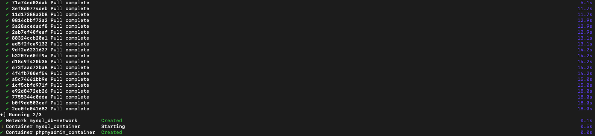
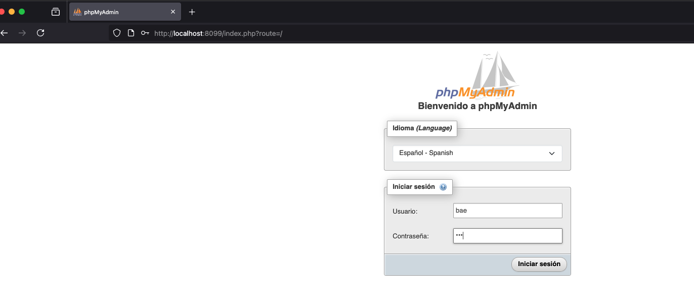
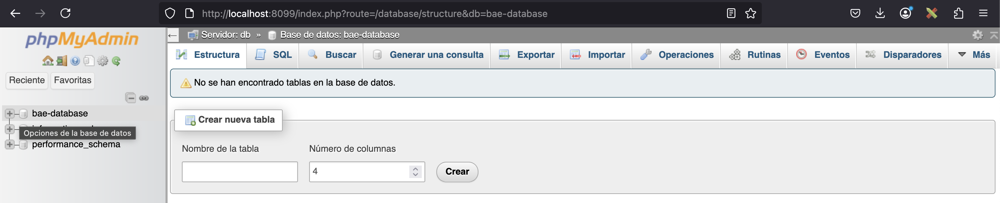

# MySQL y phpMyAdmin con Docker Compose

<div align="justify">

#  Code & Learn ("Comandos comunes en Docker")

Este repositorio contiene una configuración de Docker Compose para configurar contenedores de MySQL y phpMyAdmin. Te permite gestionar fácilmente tu base de datos MySQL usando phpMyAdmin.

## Prerrequisitos

- Docker: Asegúrate de tener Docker instalado en tu sistema. Puedes descargarlo e instalarlo desde [aquí](https://www.docker.com/get-started).

## Uso

1. Crea el directorio **mysql-phpmyadmin-docker-compose** y copia el fichero docker-compose.yml al directorio clonado.

    ```bash
    cd mysql-phpmyadmin-docker-compose
    ```

2. Modifica el archivo `docker-compose.yml` para personalizar la contraseña root de MySQL, el nombre de la base de datos, el usuario y la contraseña. Reemplaza `your_root_password`, `your_database_name`, `your_username` y `your_password` con tus credenciales deseadas. *Por defecto esta todo a* **bae**.

3. Ejecuta el siguiente comando para iniciar los contenedores.

    ```bash
    docker-compose up -d
    ```

    Este comando iniciará los contenedores de MySQL y phpMyAdmin en modo desatendido, lo que significa que se ejecutarán en segundo plano.

4. Accede a phpMyAdmin desde tu navegador web ingresando a `http://localhost:8099`. Puedes iniciar sesión usando las credenciales root de MySQL que proporcionaste.

5. Cuando termines, puedes detener y eliminar los contenedores ejecutando:

    ```bash
    docker-compose down
    ```

    Esto detendrá y eliminará ambos contenedores.

## Personalización

- Puedes personalizar la contraseña root de MySQL, el nombre de la base de datos, el usuario y la contraseña modificando las variables de entorno en el archivo `docker-compose.yml`.

- Si deseas cambiar los puertos u otras configuraciones, puedes modificar el archivo `docker-compose.yml` según sea necesario.

## Notas importantes

- El volumen de datos de MySQL se monta en `./mysql_data` en la máquina host. Esto garantiza que los datos de MySQL persistan incluso si el contenedor se detiene o elimina.

- Asegúrate de que los puertos necesarios (3306 para MySQL y 8080 para phpMyAdmin) no estén siendo utilizados por otras aplicaciones en tu sistema antes de ejecutar los contenedores.

## Verifica

### Lanzando docker desde consola



### Accediendo a PhpMyAdmin



### Consola a PhpMyAdmin


