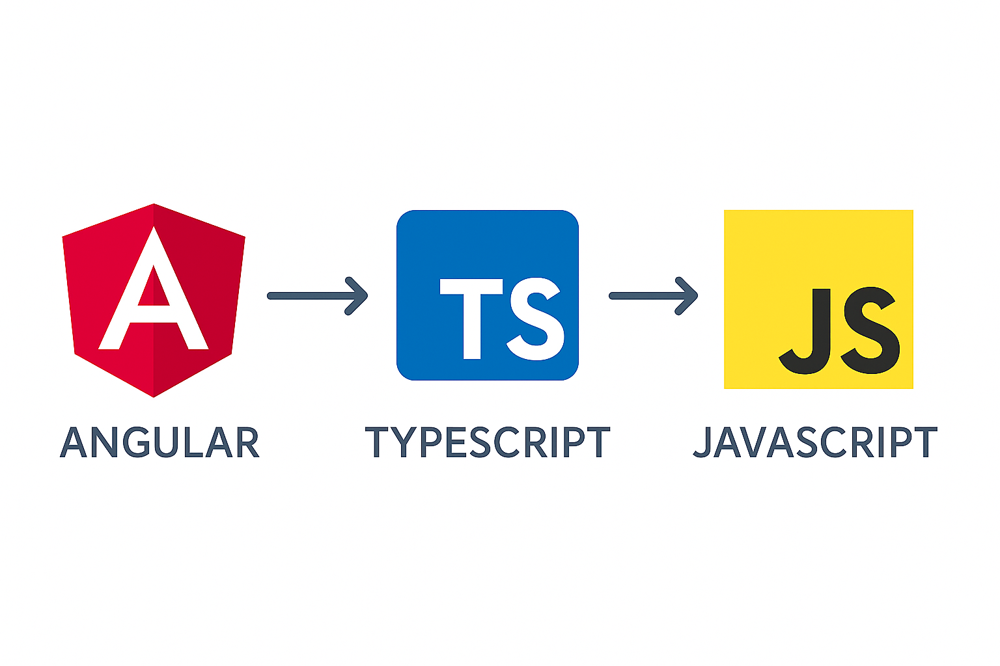

# Manual de TypeScript

A continuación vamos a ver un **manual introductorio de TypeScript**, con ejemplos prácticos y ejercicios cortos para practicar cada concepto.

<div align="center">
  
</div>

## Estructura de los apuntes

```text
├─ ejemplos/
│  ├─ 01-tipos-basicos.ts
│  ├─ 02-tipos-compuestos.ts
│  ├─ 03-funciones.ts
│  ├─ 04-interfaces.ts
│  ├─ 05-clases.ts
│  ├─ 06-genericos.ts
│  ├─ 07-modulos.ts
│  ├─ 08-tipos-utilitarios.ts
│  ├─ 09-integracion-node.ts
│  └─ 10-integracion-react-angular.ts
├─ capitulo-00-instalacion.md
├─ capitulo-01-introduccion.md
├─ capitulo-02-tipos-basicos.md
├─ capitulo-03-tipos-compuestos.md
├─ capitulo-04-funciones.md
├─ capitulo-05-interfaces-y-objetos-avanzados.md
├─ capitulo-06-clases-y-poo.md
├─ capitulo-07-genericos.md
├─ capitulo-08-modulos-y-configuracion.md
├─ capitulo-09-tipos-utilitarios-y-avanzados.md
├─ capitulo-10-integracion-y-buenas-practicas.md
├─ capitulo-11-test-unitarios.md
└─ README.md
```

## Cómo usar este manual

1. Lee los capítulos en orden (o salta al tema que necesites).
2. Abre los archivos de `ejemplos/` y ejecútalos con TypeScript/Node.
3. Realiza los **cambios propuestos** que se indican en cada sección para practicar.

## Requisitos mínimos

- Node.js (versión reciente LTS).
- npm o yarn.
- TypeScript instalado de forma local o global.

Ejemplo de instalación local:

```bash
npm init -y
npm install typescript ts-node --save-dev
npx tsc --init
```

Después podrás ejecutar los ejemplos:

```bash
npx ts-node ejemplos/01-tipos-basicos.ts
```

---

## Requisitos previos

Antes de ejecutar los ejemplos de este manual, asegúrate de tener instalado:

- **Node.js** (versión recomendada: LTS 18 o superior).
- **npm**, que viene incluido con Node.js.
- Un editor de código. Se recomienda **Visual Studio Code**.

Puedes comprobar si tienes Node y npm instalados ejecutando en la terminal:

```bash
node -v
npm -v
```

Si cualquiera de los dos comandos falla, instala la versión LTS de Node.js desde la página oficial de Node.

## Puesta en marcha rápida

Una vez descargado este repositorio (o descomprimido el ZIP), desde la carpeta `typescript` ejecuta:

```bash
npm install
```

Esto instalará las dependencias necesarias (TypeScript, ts-node y tipos de Node). Obtenendrás una salida similar a la siguiente:

```bash
npm warn deprecated inflight@1.0.6: This module is not supported, and leaks memory. Do not use it. Check out lru-cache if you want a good and tested way to coalesce async requests by a key value, which is much more comprehensive and powerful.
npm warn deprecated glob@7.2.3: Glob versions prior to v9 are no longer supported

added 293 packages, and audited 294 packages in 17s

34 packages are looking for funding
  run `npm fund` for details

found 0 vulnerabilities
```

A partir de ahí, podrás ejecutar los ejemplos de varias formas:

### Usando scripts de npm

```bash
npm run ejemplo:1   # Ejecuta ejemplos/01-tipos-basicos.ts
npm run ejemplo:2   # Ejecuta ejemplos/02-tipos-compuestos.ts
# ...
npm run ejemplo:10  # Ejecuta ejemplos/10-integracion-react-angular.ts
```

### Con ts-node directamente

```bash
npx ts-node ejemplos/01-tipos-basicos.ts
```

O cualquier otro archivo de la carpeta `ejemplos/`.

## Relación capítulos / archivos de ejemplo

- Capítulo 2 – Tipos básicos → `ejemplos/01-tipos-basicos.ts`
- Capítulo 3 – Tipos compuestos → `ejemplos/02-tipos-compuestos.ts`
- Capítulo 4 – Funciones → `ejemplos/03-funciones.ts`
- Capítulo 5 – Interfaces y objetos avanzados → `ejemplos/04-interfaces.ts`
- Capítulo 6 – Clases y POO → `ejemplos/05-clases.ts`
- Capítulo 7 – Genéricos → `ejemplos/06-genericos.ts`
- Capítulo 8 – Módulos y configuración → `ejemplos/07-modulos.ts` y `ejemplos/utilidades.ts`
- Capítulo 9 – Tipos utilitarios y avanzados → `ejemplos/08-tipos-utilitarios.ts`
- Capítulo 10 – Integración y buenas prácticas → `ejemplos/09-integracion-node.ts` y `ejemplos/10-integracion-react-angular.ts`
- Capítulo 11 – Tests unitarios en TypeScript → `capitulo-11-test-unitarios.md`

En los fragmentos de código de los capítulos puede aparecer `...` para abreviar.  
Siempre que veas `...`, recuerda que el código completo está en la carpeta `ejemplos/`.

## Resolución de problemas típica

### Error: no se reconoce el comando `npx`

Asegúrate de tener una versión moderna de npm. Ejecuta:

```bash
npm -v
```

Si es muy antigua, actualiza Node.js a una versión LTS reciente.

### Errores con módulos de Node.js (`fs`, etc.)

Este proyecto incluye un `tsconfig.json` que ya referencia los tipos de Node.  
Si ves errores relacionados con módulos de Node (`fs`, `path`, etc.), verifica que se han instalado las dependencias:

```bash
npm install
```

y que estás ejecutando los ejemplos desde la carpeta `typescript`.

## Navegación por capítulos

- [Capítulo 0: Instalación](./capitulo-00-instalacion.md)
- [Capítulo 1: Introducción](./capitulo-01-introduccion.md)
- [Capítulo 2: Tipos básicos](./capitulo-02-tipos-basicos.md)
- [Capítulo 3: Tipos compuestos](./capitulo-03-tipos-compuestos.md)
- [Capítulo 4: Funciones](./capitulo-04-funciones.md)
- [Capítulo 5: Interfaces y tipos avanzados de objetos](./capitulo-05-interfaces-y-objetos-avanzados.md)
- [Capítulo 6: Clases y Programación Orientada a Objetos en TypeScript](./capitulo-06-clases-y-poo.md)
- [Capítulo 7: Genéricos (Generics)](./capitulo-07-genericos.md)
- [Capítulo 8: Módulos y organización del código](./capitulo-08-modulos-y-configuracion.md)
- [Capítulo 9: Tipos utilitarios y características avanzadas](./capitulo-09-tipos-utilitarios-y-avanzados.md)
- [Capítulo 10: Integración con proyectos reales y buenas prácticas](./capitulo-10-integracion-y-buenas-practicas.md)
- [Capítulo 11: Tests unitarios en TypeScript](./capitulo-11-test-unitarios.md)

## Tests unitarios

Este proyecto incluye un ejemplo básico de test unitario con Jest:

- Código: `ejemplos/suma.ts`
- Test: `ejemplos/suma.test.ts`

Para ejecutarlo:

```bash
npm install
npm test
```
