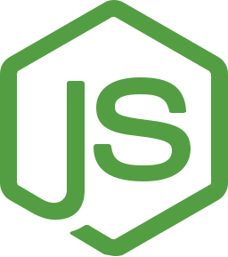

<div align="justify">

#  Code & Learn (Capítulo 0: Instalación)

<div align="center">
  
</div>

Este documento explica, paso a paso, cómo instalar **Node.js** en **Windows** y en **Linux**, y cómo comprobar que todo funciona correctamente.

Node.js es el entorno de ejecución que vas a usar para:

- Ejecutar JavaScript y TypeScript desde la línea de comandos.
- Instalar dependencias con **npm** (o **pnpm** / **yarn**).
- Trabajar con herramientas como `ts-node`, `vite`, `webpack`, Angular CLI, etc.

---

## 1. Conceptos básicos

- **Node.js**: motor de ejecución de JavaScript fuera del navegador (basado en V8).
- **npm** (*Node Package Manager*): gestor de paquetes que se instala junto con Node.  
  Lo usarás para instalar librerías:

  ```bash
  npm install typescript ts-node
  ```

- **Versión LTS**: es la versión recomendada para la mayoría de usuarios (Long Term Support).

---

## 2. Instalar Node.js en Windows

### 2.1. Opción recomendada: instalador oficial (.msi)

1. Abre el navegador y ve a la web oficial de Node.js:

   - Busca en Google: `Node.js`.
   - Entra en la página oficial (nodejs .org).

2. En la página principal verás normalmente dos descargas:
   - **LTS** (recomendada).
   - **Current** (últimas novedades, pero menos estable).

   Descarga el instalador de la versión **LTS** para **Windows (.msi)**.

3. Ejecuta el archivo descargado (`node-vXX.X.X-x64.msi`) y sigue el asistente:

   - Acepta la licencia.
   - Deja las rutas por defecto.
   - Asegúrate de dejar marcada la opción **“Add to PATH”** (o similar), para poder usar `node` y `npm` desde cualquier terminal.
   - Pulsa **Next / Install** hasta terminar.

4. Cuando finalice, abre una **ventana de terminal**:

   - Puedes usar **PowerShell**, **Símbolo del sistema (cmd)** o el terminal integrado de **Visual Studio Code**.

5. Comprueba la instalación:

   ```bash
   node -v
   npm -v
   ```

   Deberías ver algo como:

   ```text
   v18.x.x
   10.x.x
   ```

   (Los números exactos pueden cambiar, lo importante es que no salga error.)

---

### 2.2. Opción alternativa: NVM para Windows (múltiples versiones)

Si necesitas trabajar con **varias versiones de Node** (por ejemplo, proyectos antiguos y nuevos a la vez), puedes usar **NVM for Windows** (Node Version Manager):

1. Busca en Google: `nvm for windows` y descarga el instalador desde el repositorio oficial (normalmente en GitHub).

2. Instálalo siguiendo el asistente.

3. Una vez instalado, en PowerShell o cmd:

   ```bash
   nvm install 18
   nvm use 18
   ```

4. Comprueba:

   ```bash
   node -v
   ```

Con `nvm` puedes instalar y cambiar de versión cuando lo necesites:

```bash
nvm list
nvm use 20
```

---

## 3. Instalar Node.js en Linux

Hay varias formas de instalar Node.js en Linux. Las más habituales son:

1. **Usar el gestor de paquetes de tu distribución** (rápido pero a veces versiones antiguas).
2. **Usar NVM** (recomendado si quieres controlar la versión de Node).

### 3.1. Opción A: NVM (Node Version Manager) – recomendado

Funciona en la mayoría de distribuciones (Ubuntu, Debian, Fedora, etc.).

1. Instala `curl` (si no lo tienes):

   ```bash
   # Ubuntu / Debian
   sudo apt update
   sudo apt install curl -y
   ```

2. Ejecuta el script de instalación de NVM (desde la página oficial; este es un ejemplo típico):

   ```bash
   curl -o- https://raw.githubusercontent.com/nvm-sh/nvm/v0.39.7/install.sh | bash
   ```

3. Cierra y vuelve a abrir la terminal, o ejecuta:

   ```bash
   source ~/.bashrc
   # o, según el shell:
   # source ~/.zshrc
   ```

4. Comprueba que `nvm` está instalado:

   ```bash
   nvm --version
   ```

5. Instala Node.js (LTS, por ejemplo la versión 18):

   ```bash
   nvm install 18
   nvm use 18
   ```

6. Comprueba:

   ```bash
   node -v
   npm -v
   ```

---

### 3.2. Opción B: gestor de paquetes de la distribución

#### Ubuntu / Debian

```bash
sudo apt update
sudo apt install nodejs npm -y

node -v
npm -v
```

> Nota: los paquetes de los repositorios oficiales pueden estar algo desactualizados.  
> Para proyectos nuevos suele ser mejor usar **NVM** o los repos de **NodeSource**.

#### Fedora / CentOS / RHEL

```bash
sudo dnf install nodejs npm -y
# o
sudo yum install nodejs npm -y

node -v
npm -v
```

#### Arch / Manjaro

```bash
sudo pacman -S nodejs npm

node -v
npm -v
```

---

## 4. Probar que todo funciona (Windows y Linux)

Una vez tengas Node y npm instalados, haz esta pequeña prueba en cualquier sistema:

1. Crea una carpeta para pruebas:

   ```bash
   mkdir prueba-node
   cd prueba-node
   ```

2. Inicializa un proyecto:

   ```bash
   npm init -y
   ```

3. Crea un archivo `index.js`:

   ```js
   // index.js
   console.log("Node.js está funcionando 🚀");
   ```

4. Ejecuta:

   ```bash
   node index.js
   ```

Deberías ver:

```text
Node.js está funcionando 🚀
```

---

## 5. Siguiente paso: añadir TypeScript

Si ya tienes Node instalado, puedes preparar un proyecto con TypeScript:

```bash
# Dentro de la carpeta de tu proyecto
npm install --save-dev typescript ts-node
npx tsc --init
```

Esto te permitirá:

- Compilar `.ts` a `.js` con:

  ```bash
  npx tsc
  ```

- Ejecutar archivos `.ts` directamente con:

  ```bash
  npx ts-node archivo.ts
  ```

---

[Ir al índice](./README.md) · [Capítulo 1: Instroducción ➡](./capitulo-01-introduccion.md)

</div>