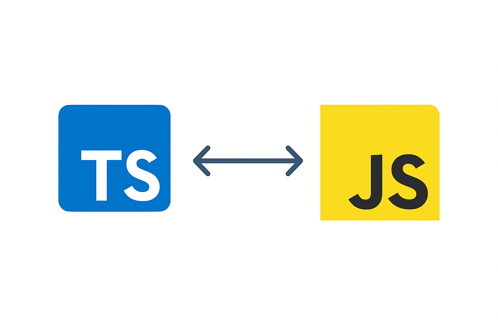

<div align="justify">

#  Code & Learn (Capítulo 1: Introducción)

## ¿Qué es TypeScript?

<div align="center">
  
</div>

**TypeScript** es un superconjunto de JavaScript que añade **tipado estático** y otras características modernas
(clases, interfaces, decoradores, etc.).  
Se `compila` (trasforma) a **JavaScript** estándar, por lo que puede ejecutarse en cualquier navegador o entorno que soporte **JS**.

### Ejemplo básico

Crea una carpeta para ir practicando:

```bash
mkdir test-js
npm init -y
npm install --save-dev typescript ts-node
npx tsc --init
```

```ts
// archivo: ejemplos/01-tipos-basicos.ts (primeros ejemplos)
let mensaje: string = "Hola TypeScript";
let veces: number = 3;

for (let i = 0; i < veces; i++) {
  console.log(mensaje);
}
```

> Guarda en un fichero ***ejempo-basico.ts***.


> **TypeScript no se ejecuta directamente**. *Primero se traduce a JavaScript (compilar/transforma), y luego ese JavaScript lo ejecuta Node.js*.

Pasos:
- `Compilar` tu `.ts` a `.js` con `tsc` (TypeScript compiler) o usar `ts-node`.
- `Ejecutar` el `.js` (o el `.ts` directamente con `ts-node`) desde la terminal.

```bash
npx tsc ejempo-basico.ts
```

Esto debe de generar el fichero:

```bash
ejempo-basico.js
```

Con un código similar al siguiente:

```js
var mensaje = "Hola TypeScript";
var veces = 3;
for (var i = 0; i < veces; i++) {
    console.log(mensaje);
}
```

Ahora ejecutamos el fichero:

```bash
node ejemplo-basico.js
```

Con la salida esperada:

```text
Hola TypeScript
Hola TypeScript
Hola TypeScript
```

> *Intenta ejecutar ahora el .ts directamente*:

```bash
npx ts-node ejemplo-basico.ts
```

Realiza las siguientes modificaciones:

```ts
let mensaje: string = "Hola TypeScript";
let veces: number = 3;

for (let i = 0; i < veces; i++) {
  console.log(mensaje);
}
```

Ejecuta nuevamente:

```bash
npx ts-node ejemplo-basico.ts
```

> Si solo declaras variables y no haces console.log / alert / etc., no verás nada en consola aunque el programa se ejecute bien.

Si intentas hacer algo como:

```ts
// Error de tipos
// mensaje = 42; // ❌ number no es asignable a string
```

> Recuerda que ***TypeScript*** *te avisará en tiempo de compilación*.

### Cambios propuestos

1. Cambia el tipo de `veces` a `string` y observa el error que produce al compararlo con `i` en el bucle.
2. Añade una nueva variable `esActivo: boolean` y úsala para decidir si se ejecuta el bucle o no.

---

## Ventajas frente a JavaScript

Algunas ventajas clave:

- **Detección temprana de errores** gracias al tipado estático.
- Mejor **autocompletado** y **refactorización** en el editor.
- Facilita el trabajo en equipos grandes con bases de código extensas.
- Hace el código más **auto-documentado**.

### Ejemplo comparativo

***JavaScript*** permite cosas así sin errores de compilación:

```js
// JavaScript puro
function suma(a, b) {
  return a + b;
}

console.log(suma(1, 2));       // 3
console.log(suma(1, "hola"));  // "1hola" (¿querías esto?)
```

En ***TypeScript***:

```ts
function sumaTS(a: number, b: number): number {
  return a + b;
}

// console.log(sumaTS(1, "hola")); // ❌ Error de tipos
console.log(sumaTS(1, 2));        //  3
```

### Cambios propuestos

1. Intenta cambiar la función de `sumaTS` para aceptar también `string` y observa cómo se complica el tipo de retorno.
2. Crea una función `multiplicaTS` que solo acepte `number` y prueba a pasarle valores incorrectos.

---

## Instalación y primeros pasos (tsc, ts-node, etc.)

### Instalación de TypeScript

Instalación local recomendada en un proyecto:

```bash
npm init -y
npm install typescript --save-dev
npx tsc --init
```

Esto crea un archivo `tsconfig.json` con la configuración del compilador.

### Cómo compilar y ejecutar TypeScript

Hay dos flujos de trabajo habituales:

1. **Compilar a JavaScript con `tsc` y ejecutar con Node.**
2. **Ejecutar directamente el `.ts` con `ts-node` (útil para desarrollo y ejemplos).

#### 1. Compilar un solo archivo `.ts` a `.js`

```bash
npx tsc ejemplos/01-tipos-basicos.ts
```

Esto generará un archivo JavaScript (por ejemplo `ejemplos/01-tipos-basicos.js`) que puedes ejecutar con:

```bash
node ejemplos/01-tipos-basicos.js
```

> Intenta ej

#### 2. Compilar todo el proyecto con `tsconfig.json`

Cuando tienes un `tsconfig.json` con `"outDir": "dist"`, puedes compilar todos los archivos `.ts` del proyecto con:

```bash
npx tsc
```

Esto generará los `.js` correspondientes en la carpeta `dist/`.  
Por ejemplo, si tenías `ejemplos/01-tipos-basicos.ts`, se generará algo como `dist/01-tipos-basicos.js`.

#### 3. Ejecutar el JavaScript generado

```bash
node dist/01-tipos-basicos.js
```

De esta forma, el flujo es:

1. Escribir TypeScript (`.ts`).
2. Compilar a JavaScript (`.js`) con `tsc`.
3. Ejecutar el JavaScript con Node.

#### 4. Ejecutar directamente con `ts-node` (opcional)

Para no tener que compilar a archivos `.js` en disco durante los ejemplos, también puedes usar `ts-node`:

```bash
npm install ts-node --save-dev

npx ts-node ejemplos/01-tipos-basicos.ts
```

Aquí `ts-node` compila en memoria el archivo `.ts` y lo ejecuta directamente con Node.


### Ejemplo mínimo de `tsconfig.json`

```json
{
  "compilerOptions": {
    "target": "ES2019",
    "module": "commonjs",
    "strict": true,
    "outDir": "dist"
  },
  "include": ["ejemplos/**/*"]
}
```

### Cambios propuestos

1. Modifica el `target` de `ES2019` a otra versión (por ejemplo `ES2020`) y observa si cambia algo en el código generado.
2. Cambia `strict` a `false`, vuelve a escribir un ejemplo “peligroso” (como asignar un tipo incorrecto) y comprueba si TypeScript sigue quejándose.

## Comparación entre Java, Python, JavaScript y TypeScript

Muchos conceptos de TypeScript resultan más fáciles de entender si ya conoces **Java** o **Python**.

### Paradigma y uso principal

- **Java**: lenguaje **orientado a objetos**, fuertemente tipado y compilado. Se usa mucho en backend, Android y sistemas empresariales.
- **Python**: lenguaje **multiparadigma**, de tipado dinámico, muy usado en ciencia de datos, scripting y backend.
- **JavaScript**: lenguaje **dinámico**, pensado originalmente para el navegador, hoy también muy usado en backend (Node.js).
- **TypeScript**: un **superconjunto de JavaScript** con **tipado estático**. Se escribe TS, se compila a JS, y luego se ejecuta como JavaScript.

### Tipado

- **Java**: tipado estático y **nominal** (los tipos se identifican por nombre: clases, interfaces).
- **Python**: tipado dinámico; las anotaciones de tipos (`def f(x: int) -> str`) son opcionales y solo las usa el analizador estático.
- **JavaScript**: tipado dinámico; las variables pueden cambiar de tipo en tiempo de ejecución.
- **TypeScript**: tipado estático y **estructural** (un objeto es válido si tiene las propiedades necesarias, aunque el “nombre” del tipo no coincida).  
  En tiempo de ejecución, solo queda JavaScript; los tipos desaparecen.

### Sintaxis básica

- La sintaxis de TypeScript se parece mucho a **Java** en:
  - Uso de `;` (opcional), llaves `{}` para bloques y `class`, `interface`, `extends`, `implements`.
  - Declaración de tipos en parámetros y variables: `nombre: string`, `edad: number`.
- También se parece a **Python con type hints**:
  - `function sumar(a: number, b: number): number` (TypeScript)  
    es conceptualmente igual a  
    `def sumar(a: int, b: int) -> int` (Python con anotaciones).

### Resumen intuitivo

- Si vienes de **Java**, puedes ver TypeScript como “**Java light que genera JavaScript**”:
  - Clases, interfaces, genéricos y módulos se sienten familiares.
- Si vienes de **Python**, puedes verlo como “**JavaScript con type hints obligatorios**”:
  - Los tipos se anotan como en Python, pero el compilador no te deja ignorarlos.

---

[Ir al índice](./README.md) · [Capítulo 2: Tipos básicos ➡](./capitulo-02-tipos-basicos.md)

</div>