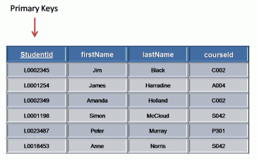
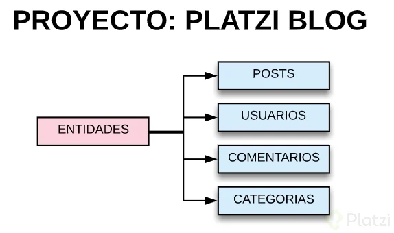
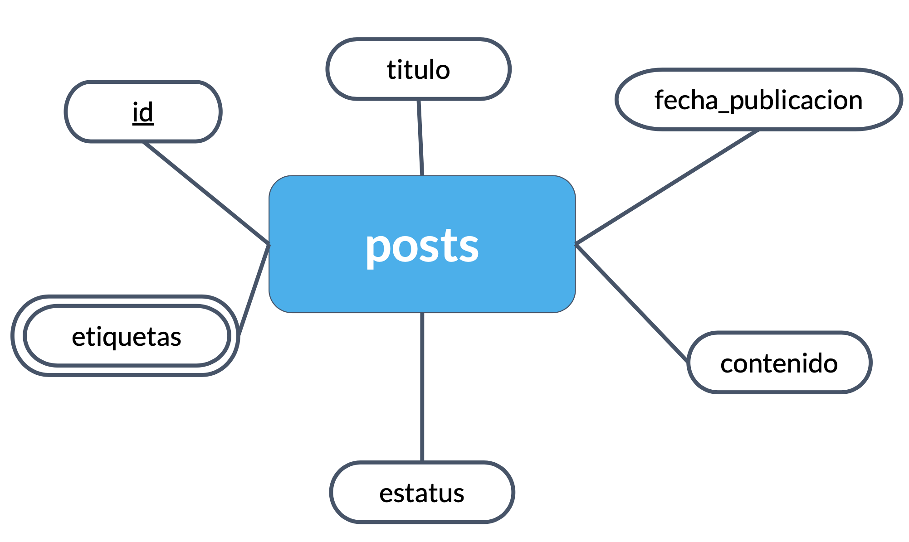

# INTRODUCCIÓN-A-LAS-BASES-DE-DATOS-RELACIONALES

- Índice:
  - [Historia de las RDB](#Historia-de-las-RDB)
  - [Entidades y atributos](#Entidades-y-atributos)
  - [Entidades del Platziblog](#Entidades-del-Platziblog)

# INTRODUCCIÓN A LAS BASES DE DATOS RELACIONALES

## Historia de las RDB

> Las bases de datos surgen de la necesidad de conservar la información más allá de lo que existe en la memoria RAM. El modelo de von Neumann o arquitectura Princeton, es una arquitectura de computadoras que constaba de una unidad de procesamiento, una unidad de control, una memoria y mecanismos de entrada y salida  

> Sin embargo la memoria del modelo de von Neuman solo se utilizaba para almacenar tanto datos como instrucciones (lo que hoy sería el equivalente a la RAM), mas no contemplaba el guardado de datos persistentes. En este punto se empezaron a buscar formas de como guardar estos datos. Así surgen primero las bases de datos basadas en archivos eran datos guardados en texto plano, fáciles de guardar pero muy difíciles de consultar.

 

 
  
  <h5>Modelo de von Neuman</h5>

 

> Ante la necesidad de mejorar esto nacen las bases de datos relacionales. Su inventor Edgar Codd dejó ciertas reglas para asegurarse de que toda la filosofía de las bases de datos no se perdiera (LAS 12 REGLAS DE CODD), estandarizando de este modo el el proceso, estó a raiz de que en 1990 Codd mismo se preocupó al ver que ciertos sistemas de gestión de bases de datos (SGBD) que decían ser relacionales, no lo eran. Además de ello Codd invento el ALGEBRA RELACIONAL. 

Reglas  | Descripción
------------- | -------------
Regla 0: Regla de fundación. | Cualquier sistema que se proclame como relacional, debe ser capaz de gestionar sus bases de datos enteramente mediante sus capacidades relacionales.
Regla 1: Regla de la información. | a) Todos los datos deben estar almacenados en las tablas.   b) Esas tablas deben cumplir las premisas del modelo relacional.  c) No puede haber información a la que accedemos por otra vía.
Regla 2: Regla del acceso garantizado. | a) Cualquier dato es accesible sabiendo la clave de su fila y el nombre de su columna o atributo.  b) Si a un dato no podemos acceder de esta forma, no estamos usando un modelo relacional.
Regla 3: Regla del tratamiento sistemático de valores nulos. | a) Esos valores pueden dar significado a la columna que los contiene.   b) El SGBD debe tener la capacidad de manejar valores nulos.   c) El SGBD reconocerá este valor diferenciándolo de cualquier otro.   d) El SGBD deberá aplicársele la lógica apropiada.   e) Es un valor independiente del tipo de datos de la columna.
Regla 4: Catálogo dinámico en línea basado en el modelo relacional. | a) El catálogo en línea es el diccionario de datos.   b) El diccionario de datos se debe de poder consultar usando las mismas técnicas que para los datos.   c) Los metadatos, por tanto, se organizan también en tablas relacionales.   d) Si SELECT es una instrucción que consulta datos, también será la que consulta los metadatos.
Regla 5: Regla comprensiva del sublenguaje de los datos completo. | a) Al menos tiene que existir un lenguaje capaz de hacer todas las funciones del SGBD.   b) No puede haber funciones fuera de ese lenguaje.   c) Puede haber otros lenguajes en el SGBD para hacer ciertas tareas.   d) Pero esas tareas también se deben poder hacer con el “lenguaje completo”.
Regla 6: Regla de actualización de vistas. | a) Las vistas tienen que mostrar información actualizada.   b) No puede haber diferencias entre los datos de las vistas y los datos de las tablas base.
Regla 7: Alto nivel de inserción, actualización, y cancelación. | a) La idea es que el lenguaje que maneja la base de datos sea muy humano.   b) Eso implica que las operaciones del lenguaje de manipulación de los datos (DML) trabajen con conjuntos de filas a la vez.   c) Para modificar, eliminar o añadir datos, no hará falta programar de la forma en la que lo hacen los lenguajes de tercera generación como C o Java.
Regla 8: Independencia física de los datos. | a) Cambios en la física de la BD no afecta a las aplicaciones ni a los esquemas lógicos.   b) El acceso a las tablas (elemento lógico) no cambia porque la física de la base de datos cambie.
Regla 9: Independencias lógicas de los datos. | a) Cambios en el esquema lógico (tablas) de la BD no afectan al resto de esquemas.   b) Si cambiamos nombres de tabla, o de columna o modificamos información de las filas, las aplicaciones (esquema externo) no se ven afectadas.   c) Es más difícil de conseguir.
Regla 10: Independencia de la integridad. | a) Las reglas de integridad (restricciones) deben de ser gestionadas y almacenadas por el SGBD.
Regla 11: Independencia de la distribución. | a) Que la base de datos se almacene o gestione de forma distribuida en varios servidores, no afecta al uso de esta ni a la programación de las aplicaciones de usuario.   b) El esquema lógico es el mismo independientemente de si la BD es distribuida o no.
Regla 12: La regla de la no subversión. | a) La base de datos no permitirá que exista un lenguaje o forma de acceso, que permita saltarse las reglas anteriores.

## Entidades y atributos

>Entidad: Es algo similar a un objeto (revisar progrmación orientada a objetos), la diferencia con estos últimos, es que una entidad solo se refiere a los datos, en cambio un objeto se refiere a datos y los métodos (o funciones) como tal que controlan estos datos. En bases de datos, una entidad es cuando abstraemos un objeto de la vida real. Al igual que los obejtos las entidades poseen atributos ligados a si, que son las cosas que los hacen ser una entidad. Por convención se diagraman dentro de cuadrados y por además se ponen en plural.

 

 
  
  <h5>Entidad "laptops"</h5>

 

>Atributos: Son las características que podemos proporcionarles a una entidad, y que por convención se representan con ovalos. Existen ciertos atributos especiales a los que se les desgina de forma particular:

ATRIBUTOS  | Descripción
------------- | -------------
Multivaluado | Puede poseer multiples valores (ejemplo: 4 valores diferentes par el atributo "llantas" de la entidad "automóviles").
Compuestos | Los cuales están compuestos por otros atributos (ejemplo: para la entidad "laptos" el atributo "metodos de entrada " esta compuesto por el atributo "trackpad" y "teclado"). 
Especiales (almacenados y derivados)| Que puedes representarse con líneas punteadas (ejemplo: antiguedad o edad de una persona, se puede primero determinar en la misma base de datos la fecha de nacimiento y cuando la edad sea desfasada, se actualiza automáticamente a partir de su fecha de nacimiento.)

 

 
  
  <h5>Atributos de la entidad "laptops"</h5>

 

> Pero quizá los atributos mas importantes,sean los denominados los ATRIBUTOS LLAVES son aquellos que identifican a la entidad y no pueden ser repetidos. Se representan con un subrayado. Existen principalemnte 2:  
> -Naturales: son inherentes al objeto como el número de serie.  
> -Clave artificial: no es inherente al objeto y se asigna de manera arbitraria.

 

 
  
  <h5>Atributo llave "Student id"</h5>

 

> Finalmente debemos conocer que las entidades pueden ser  
> -Entidades fuertes: Son entidades que pueden sobrevivir por si solo. Al leer la tabla sabes que son las entidades (se encierra en un recuadro).  
> -Entidades débiles: No puede existir sin una entidad fuerte. Al leer la tabla no puedes saber que son las entidades (se encierra en un recuadro doble). En esto podemos diferenciar 2 subtipos: las **Identidades Débiles por Identidad** (no se diferencian entre sí más que por la clave de su identidad fuerte) y las **Identidades Débiles por Existencia** (que se les asigna una clave propia, pero su existencia sigue siendo dependiente de una fuerte).

 

 
  
  <h5>Resumen representativo de entidades y atributos</h5>

 

## Entidades del Platziblog

> Durante el curso desarrollares un proyecto completo de inicio a fin basandonos en un Platziblog. Este proyecto nos presenta un contexto familiar y nos representará retos muy interesantes.  
> -Primer paso: Identificar las entidades.
 

 
  
  <h5>Las Entidades del Platziblog</h5>

 

> Segundo paso: Pensar en los atributos.
 

 
  
  <h5> Atributos de entidad "Posts"</h5>

 

 
  
  <h5> Atributos de entidad "Usuarios"</h5>

 

> Una recomendación importante que es que no utilicemos el correo del usuario como id. Es mejor generar un id independiente para cada usuario puesto que a pesar de que email es único, limitará la identificación cuando el usuario quiera cambiar su email.

