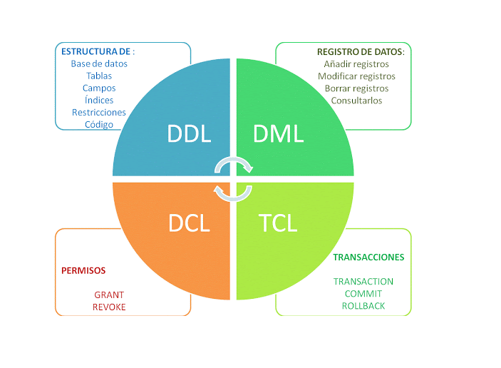

#  Code & Learn (SQL - Sentencias SQL a través de ejemplos)

## Según el tipo de Lenguaje en BBDD (DDL, DML, DCL y TCL))

### 5.1: Lenguaje de Definición de Datos (DDL - Data Definition Language)

#### 📌 Sentencias principales

- `CREATE DATABASE` – Creación de bases de datos](01-Comandos-basicos.md).
- [`CREATE TABLE` – Creación de tablas](01_crear_borrar_tabla.md).
- `ALTER TABLE` – Modificación de la estructura de una tabla.
- `DROP DATABASE` – Eliminación de una base de datos.
- [`DROP TABLE` – Eliminación de una tabla](01_crear_borrar_tabla.md).
- `TRUNCATE TABLE` – Vaciar una tabla sin eliminar su estructura.
- Restricciones: `PRIMARY KEY`, `FOREIGN KEY`, `UNIQUE`, `NOT NULL`, `CHECK`.

### Apartado 5.2: Consultas sobre una tabla (DQL - Data Query Language)

#### 📌 Sentencias principales

- [`SELECT` – Consulta de datos en una tabla](02_insert_select.md).
- [`WHERE` – Filtrado de registros](03_where.md).
- [`ORDER BY` – Ordenación de resultados](13_order_by.md).
- [`DISTINCT` – Eliminación de duplicados](24_distinct.md).
- `LIMIT` – Restricción de filas en la consulta.

### Apartado 5.3: Consultas sobre varias tablas – Composición interna y cruzada

#### 📌 Sentencias principales

- [`INNER JOIN` – Combinación de registros relacionados en dos tablas](26_inner_join_.md).

### Apartado 5.4: Consultas sobre varias tablas – Composición externa

#### 📌 Sentencias principales

- [`LEFT JOIN` – Devuelve todos los registros de la tabla izquierda y los coincidentes de la derecha](27_left_join.md).
- [`RIGHT JOIN` – Devuelve todos los registros de la tabla derecha y los coincidentes de la izquierda](28_right_join.md).
- [`FULL OUTER JOIN` – Devuelve todos los registros de ambas tablas, con o sin coincidencias].

### Apartado 5.5: Consultas resumen (Funciones Agregadas y Agrupaciones)

#### 📌 Sentencias principales

- [`COUNT()` – Contar registros](19_count.md).
- [`SUM()` – Sumar valores de una columna](14_operadores_logicos.md).
- [`AVG()` – Calcular el promedio de valores](14_operadores_logicos.md).
- [`MAX()` / `MIN()` – Obtener el valor máximo y mínimo].14_operadores_logicos.md).
- [`GROUP BY` – Agrupar registros según un criterio](22_group_by.md).
- [`HAVING` – Filtrar resultados después de una agrupación](23_having.md).

### Apartado 5.6: Subconsultas (Subqueries)

#### 📌 Sentencias principales

- [Subconsultas en `SELECT`](02_insert_select.md).
- [Subconsultas en `WHERE`](03_where.md).
- [Subconsultas en `HAVING`](23_having.md).
- [Uso de `EXISTS`](17_exists.md) e [`IN`](17_in.md).

## Consultas Básicas a través de ejemplos

- [Consultas Básicas a través de clausulas](consultas-basicas-clausulas.md).

## Comandos Básicos de SQLite a través de ejemplos

- [Importante - Comandos Meta](comandos_sqlite.md).
- [Tipos de Datos](00_tipos_basicos.md).
- [Comandos básicos con ejemplo clase](01-Comandos-basicos.md).
- [Crear/Borrar Tabla](01_crear_borrar_tabla.md).
- [Insertar datos](02_insert_select.md).
- [Condición (where)](03_where.md).
- [Operadores Relacionales](04_operadores_reacionales.md).
- [Delete](05_delete.md).
- [Update](06_update.md).
- [Comentarios](07_comments.md).
- [Null](08_null.md).
- [Definir la clave primaria](09_primary_key.md).
- [Autoincremento](10_autoincrement.md).
- [Clave Foránea (FK)](11_foreign-key.md).
- [Operadores Aritméticos](12_%20operadores_aritmeticos.md).
- [Operador Default](12_default.md).
- [Cláusula order by](13_order_by.md).
- [Operadores Lógicos](14_operadores_logicos.md).
- [Opción IS NULL](15_is_null.md).
- [Cláusula Between](16_%20between.md).
- [Cláusula IN](17_in.md).
- [Cláusula Like](18_like.md).
- [Cláusula Count](19_count.md).
- [Agrupamientos](20_agrupamiento.md).
- [Expresiones regulares en sentencias](21_regexp.md).
- [Cláusula Group By](22_group_by.md).
- [Cláusula Having](23_having.md).
- [Cláusula Distinc](24_distinct.md).
- [Cláusula Join](25_join_.md).
- [Unit tablas](25_unir_tablas_.md).
- [Joins y sus tipos](30_tipos_join.md).
  - [Cláusula Inner Join](26_inner_join_.md).
  - [Cláusula Left Join](27_left_join_.md).
  - [Cláusula Right Join](28_right_join_.md).
  - [Cláusula where y join, semejanzas y diferencias](30_where_join.md).
- [Subconsultas](29_sub_consultas.md).

