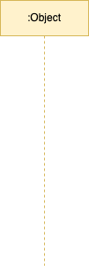
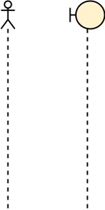
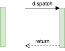
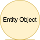

<div align="justify">

#  Code & Learn (Entornos de Desarrollo - Diagramas de Secuencia)

# Diagrama de Secuencia en UML

El **Diagrama de Secuencia** en UML es un tipo de diagrama conductual que se utiliza para representar la interacción entre objetos o componentes de un sistema a lo largo del tiempo. Este diagrama muestra cómo los objetos interactúan entre sí enviándose mensajes de un lado a otro, y cómo esos mensajes se suceden en el tiempo.

## Propósito

El objetivo principal del diagrama de secuencia es ilustrar el flujo de control de un sistema en términos de las interacciones entre los objetos, y cómo esos objetos se comunican entre sí para realizar una tarea o proceso específico.

## Componentes de un Diagrama de Secuencia

<!--

| Elemento               | Descripción |
|------------------------|-------------|
| **📌 Actores** | Representan entidades externas que interactúan con el sistema (usuarios, otros sistemas). Se colocan generalmente en el lado izquierdo del diagrama. |
| **🟦 Objetos** | Instancias de clases que participan en la secuencia. Se representan con un rectángulo con el nombre del objeto y su clase subrayados. |
| **📊 Líneas de vida** | Representan la existencia de un objeto o actor durante la interacción. Son líneas verticales que muestran el tiempo de vida de cada objeto. |
| **📏 Cuadros de activación** | Indican el período en que un objeto realiza una acción. Se representan con un rectángulo estrecho sobre la línea de vida. |
| **🔄 Autollamadas** | Si un objeto envía un mensaje a sí mismo, se usa una flecha que regresa al mismo objeto. Se emplea para representar recursión o llamadas internas. |

## 📩 Tipos de Mensajes

| Tipo de Mensaje          | Descripción |
|-------------------------|-------------|
| **➡ Mensaje Sincrónico** | Representa una llamada de función en la que el remitente espera una respuesta antes de continuar. Se representa con una flecha de línea sólida y punta cerrada. |
| **↗ Mensaje Asincrónico** | Representa una comunicación en la que el remitente no espera una respuesta inmediata. Se representa con una flecha de línea sólida con punta abierta. |
| **↩ Retornos** | Representan respuestas a mensajes enviados. Se dibujan con una línea de puntos y una flecha en dirección al remitente del mensaje. |
| **❌ Mensaje Eliminado** | Indica la destrucción de un objeto durante la secuencia. Se representa con una "X" en la línea de vida del objeto. |

## 🔄 Fragmentos Combinados

| Fragmento Combinado     | Descripción |
|------------------------|-------------|
| **🔁 Loop (Bucle)** | Representa una repetición de acciones dentro de un rango de condiciones. Se encierra en un rectángulo con la etiqueta `loop`. |
| **⚖ Alt (Alternativa)** | Representa una estructura de decisión tipo `if-else`. Se encierra en un rectángulo con la etiqueta `alt` y se divide en dos secciones. |
| **🔀 Par (Paralelo)** | Representa ejecución paralela de acciones. Se usa la etiqueta `par` dentro del fragmento. |
| **🔂 Opcional** | Representa un bloque opcional (`if` simple). Se etiqueta como `opt` y contiene una condición. |
-->


| Elemento               | Imagen | Descripción |
|------------------------|--------|-------------|
| **📌 Actores** |  | Representan entidades externas que interactúan con el sistema (usuarios, otros sistemas). Se colocan generalmente en el lado izquierdo del diagrama. |
| **🟦 Objetos** |  | Instancias de clases que participan en la secuencia. Se representan con un rectángulo con el nombre del objeto y su clase subrayados. |
| **📊 Líneas de vida** |  | Representan la existencia de un objeto o actor durante la interacción. Son líneas verticales que muestran el tiempo de vida de cada objeto. |
| **📏 Cuadros de activación** |  | Indican el período en que un objeto realiza una acción. Se representan con un rectángulo estrecho sobre la línea de vida. |
| **🔄 Autollamadas** |  | Si un objeto envía un mensaje a sí mismo, se usa una flecha que regresa al mismo objeto. Se emplea para representar recursión o llamadas internas. |

## 📩 Tipos de Mensajes

| Tipo de Mensaje          | Imagen | Descripción |
|-------------------------|--------|-------------|
| **➡ Mensaje Sincrónico** |  | Representa una llamada de función en la que el remitente espera una respuesta antes de continuar. Se representa con una flecha de línea sólida y punta cerrada. |
| **↗ Mensaje Asincrónico** |  | Representa una comunicación en la que el remitente no espera una respuesta inmediata. Se representa con una flecha de línea sólida con punta abierta. |
| **↩ Retornos** |  | Representan respuestas a mensajes enviados. Se dibujan con una línea de puntos y una flecha en dirección al remitente del mensaje. |
| **❌ Mensaje Eliminado** |  | Indica la destrucción de un objeto durante la secuencia. Se representa con una "X" en la línea de vida del objeto. |

## 🔄 Fragmentos Combinados

| Fragmento Combinado     | Imagen | Descripción |
|------------------------|--------|-------------|
| **🔁 Loop (Bucle)** |  | Representa una repetición de acciones dentro de un rango de condiciones. Se encierra en un rectángulo con la etiqueta `loop`. |
| **⚖ Alt (Alternativa)** |  | Representa una estructura de decisión tipo `if-else`. Se encierra en un rectángulo con la etiqueta `alt` y se divide en dos secciones. |
| **🔀 Par (Paralelo)** |  | Representa ejecución paralela de acciones. Se usa la etiqueta `par` dentro del fragmento. |
| **🔂 Opcional** |  | Representa un bloque opcional (`if` simple). Se etiqueta como `opt` y contiene una condición. |

📌 **Nota**: Las imágenes utilizadas provienen de [Wikimedia Commons](https://commons.wikimedia.org/wiki/Category:UML_sequence_diagrams).

---

## 🖥 **Ejemplo de Diagrama de Secuencia**

```mermaid
sequenceDiagram
    participant Usuario
    participant Sistema
    Usuario ->> Sistema: Ingresa credenciales
    Sistema ->> Usuario: Validar usuario
    Usuario ->> Sistema: Solicita información
    Sistema ->> Usuario: Retorna datos
 ```

## Compra en línea

Consideremos un diagrama de secuencia para el proceso de compra en línea de un producto:

```mermaid
sequenceDiagram
    participant Usuario
    participant "Sistema de Tienda" as Tienda
    participant "Sistema de Pago" as Pago

    Usuario ->> Tienda: 1. Iniciar sesión
    Tienda ->> Pago: 2. Verificar usuario
    
    Usuario ->> Tienda: 3. Seleccionar producto
    
    Usuario ->> Tienda: 4. Realizar pago
    Tienda ->> Pago: 5. Autorizar pago
    Pago -->> Tienda: Confirmación de pago

    Tienda ->> Usuario: 6. Confirmar compra
```

## Casos de Uso

El Diagrama de Secuencia se usa comúnmente en los siguientes escenarios:

- **Modelado de procesos de negocio**: Para mostrar cómo las entidades interactúan en el marco de un proceso de negocio.
- **Desarrollo de software**: Durante la fase de diseño, para especificar interacciones entre componentes del sistema.
- **Comunicación entre sistemas**: Para representar la interacción entre diferentes sistemas o subsistemas en un entorno distribuido.

</div>