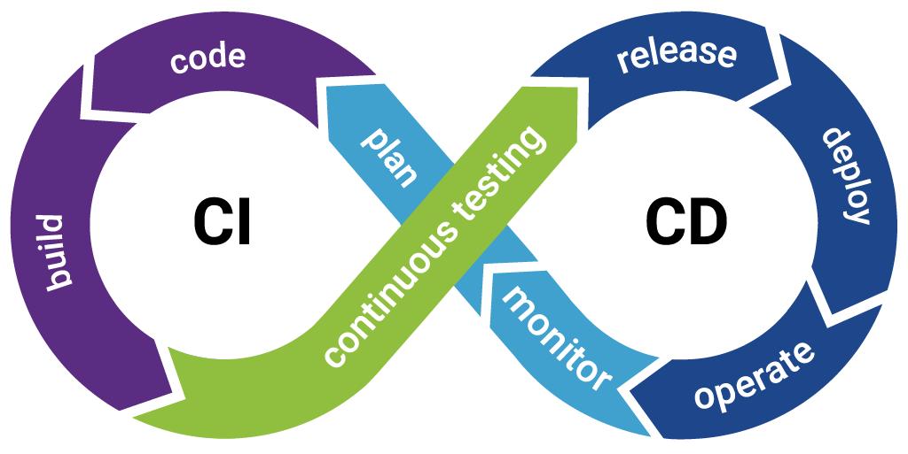

<div align="justify">

#  Code & Learn (Entornos de Desarrollo - Integración Continua)



## ¿Qué es la Integración Continua?
La Integración Continua (CI, por sus siglas en inglés) es una práctica de desarrollo de software en la que los desarrolladores integran su código en un repositorio compartido con frecuencia. Cada integración se verifica mediante una compilación automatizada y pruebas para detectar errores lo antes posible.

## Beneficios de la Integración Continua
- **Detección temprana de errores**: Al integrar y probar código con frecuencia, los errores se identifican rápidamente.
- **Mayor calidad del software**: La automatización de pruebas garantiza un código más estable y funcional.
- **Reducción del tiempo de entrega**: Facilita un flujo de desarrollo más ágil y predecible.
- **Facilita la colaboración**: Permite que varios desarrolladores trabajen en un mismo proyecto sin conflictos de integración.

## Flujo de Trabajo en CI
1. **Código en Repositorio**: Los desarrolladores suben cambios a un sistema de control de versiones (Git, SVN, etc.).
2. **Servidor de Integración Continua**: Un servidor (Jenkins, GitHub Actions, GitLab CI/CD, Travis CI) detecta los cambios.
3. **Construcción Automatizada**: Se compila el código y se generan artefactos.
4. **Ejecución de Pruebas**: Se ejecutan pruebas unitarias, de integración y funcionales.
5. **Feedback Rápido**: Se notifican errores a los desarrolladores mediante reportes o alertas.
6. **Implementación (Opcional)**: Si todo es exitoso, se puede desplegar automáticamente en un entorno de prueba o producción.

## Herramientas de Integración Continua
Algunas herramientas populares para CI incluyen:
- **Jenkins**: Plataforma de automatización open-source.
- **GitHub Actions**: Integrado con GitHub para CI/CD.
- **GitLab CI/CD**: Integración nativa en GitLab.
- **Travis CI**: Servicio de CI basado en la nube.
- **CircleCI**: Plataforma optimizada para despliegues rápidos.

## Ejemplo de Configuración en GitHub Actions
```yaml
name: CI Pipeline

on:
  push:
    branches:
      - main
  pull_request:
    branches:
      - main

jobs:
  build:
    runs-on: ubuntu-latest

    steps:
      - name: Checkout Repository
        uses: actions/checkout@v2
      
      - name: Set up Node.js
        uses: actions/setup-node@v2
        with:
          node-version: '16'
      
      - name: Install Dependencies
        run: npm install
      
      - name: Run Tests
        run: npm test
```

## Conclusión
La Integración Continua es una práctica fundamental para equipos de desarrollo modernos, permitiendo entregar software de mayor calidad, con menos errores y de manera más rápida. Implementarla con herramientas adecuadas puede mejorar significativamente el proceso de desarrollo y entrega de aplicaciones.

</div>