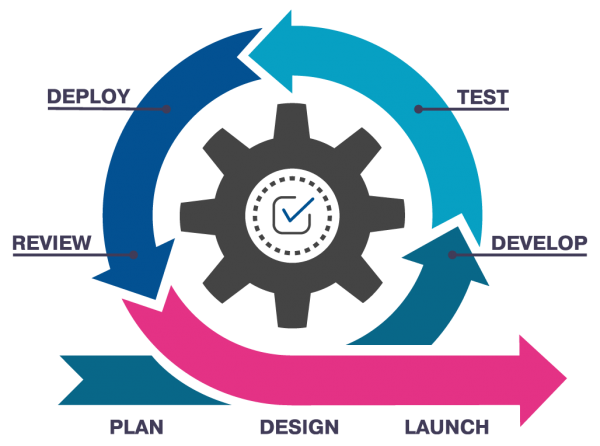

#  Code & Learn (Entornos de Desarrollo - Integración Continua)

## ¿Qué son las Metodologías Ágiles?

Las metodologías ágiles son un conjunto de principios y prácticas para el desarrollo de software que enfatizan la flexibilidad, la colaboración y la entrega rápida de productos funcionales. Estas metodologías buscan adaptarse a cambios en los requisitos y fomentar una comunicación continua entre los miembros del equipo.

## Principios del Manifiesto Ágil

El Manifiesto Ágil, creado en 2001, establece los siguientes valores fundamentales:

1. **Individuos e interacciones** sobre procesos y herramientas.
2. **Software funcionando** sobre documentación extensiva.
3. **Colaboración con el cliente** sobre negociación de contratos.
4. **Respuesta ante el cambio** sobre seguir un plan rígido.

## Principales Metodologías Ágiles

### 1. Scrum
Scrum es un marco de trabajo ágil basado en iteraciones llamadas *sprints*, que suelen durar entre 1 y 4 semanas. Se basa en los siguientes roles:

- **Scrum Master**: Facilita el proceso ágil y ayuda a eliminar impedimentos.
- **Product Owner**: Representa los intereses del cliente y prioriza las tareas.
- **Equipo de Desarrollo**: Desarrolla y entrega incrementos de software.

#### Eventos Clave en Scrum:

- **Sprint Planning**: Planificación del sprint.
- **Daily Stand-up**: Reunión diaria para sincronizar el equipo.
- **Sprint Review**: Revisión del trabajo realizado.
- **Sprint Retrospective**: Reflexión sobre el proceso y mejoras.

### 2. Kanban

Kanban es una metodología visual que gestiona el flujo de trabajo mediante un tablero dividido en columnas, como:

- **Por hacer**
- **En progreso**
- **Hecho**

Se enfoca en la mejora continua y la limitación del trabajo en curso (*WIP*).

### 3. Extreme Programming (XP)

XP es una metodología que enfatiza la calidad del software y la satisfacción del cliente mediante prácticas como:

- Desarrollo basado en pruebas (*TDD*).
- Programación en parejas (*Pair Programming*).
- Integración continua.
- Diseño simple y mejoras incrementales.

### 4. Lean Software Development

Inspirada en la filosofía Lean Manufacturing de Toyota, esta metodología busca eliminar desperdicios y optimizar el flujo de trabajo. Sus principios incluyen:

- Entregar rápido.
- Mejorar continuamente.
- Construir calidad en el proceso.

## Beneficios de las Metodologías Ágiles

- **Mayor flexibilidad** ante cambios en los requisitos.
- **Entrega más rápida** y frecuente de software funcional.
- **Mejor comunicación** entre equipos y clientes.
- **Mayor satisfacción del cliente** gracias a la retroalimentación continua.

## Conclusión

Las metodologías ágiles han revolucionado el desarrollo de software al priorizar la adaptabilidad y la colaboración. Elegir la metodología adecuada depende del equipo y del proyecto en cuestión.

