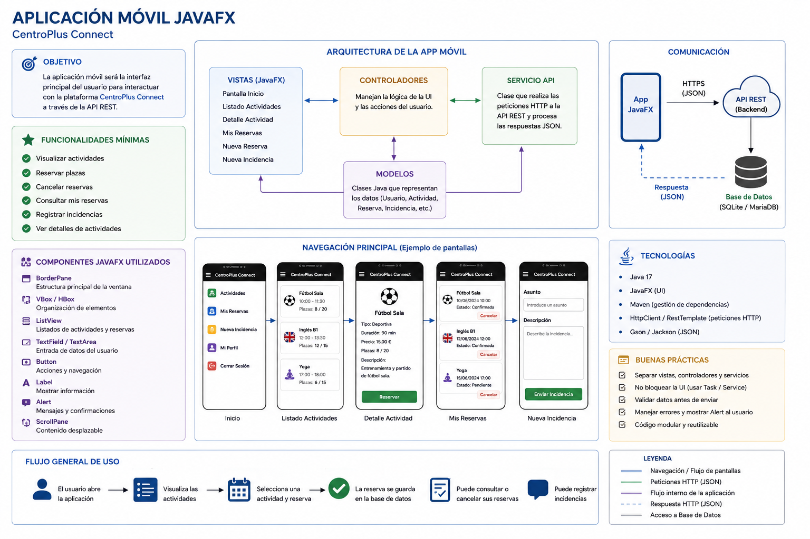

<div align="justify">

# CentroPlus Connect

Construcción guiada de la aplicación móvil `JavaFX`.

---

## 1. Objetivo de esta parte del proyecto

En esta parte del proyecto vamos a construir la **aplicación móvil JavaFX** de CentroPlus Connect.

La aplicación será la interfaz que utilizará el usuario para:

- consultar actividades;
- ver plazas disponibles;
- reservar plaza;
- consultar sus reservas;
- cancelar reservas;
- registrar incidencias.

La aplicación se construirá siguiendo una arquitectura por capas, pero **el alumnado deberá implementar la lógica principal**.

---

## 2. Qué vamos a construir

Construiremos una aplicación JavaFX con apariencia móvil.

La aplicación tendrá varias pantallas:

| Pantalla | Función |
|---|---|
| Inicio | Menú principal y resumen |
| Actividades | Listado de actividades disponibles |
| Detalle de actividad | Información de una actividad concreta |
| Reservas | Consulta y cancelación de reservas |
| Incidencias | Formulario para comunicar una incidencia |

<div align="center" width="300">
     
</div>

---

## 3. Arquitectura de la aplicación JavaFX

La aplicación se organizará en capas:

```text
views / controllers
        ↓
services
        ↓
repositories
        ↓
models
```

---

## 4. Importante

En este README **no se incluye el código fuente completo** de:

- modelos;
- repositorios;
- servicios.

> El objetivo es que el alumnado los construya, recueda como lo hacemos en clase. 

- [Ejemplo app-básica](../../pro/unidades/unidad-5/PROYECTO-MAVEN.md).

---

## 5. Estructura recomendada del proyecto

La estructura recomendada será:

```text
mobile-app/
│
├── pom.xml
│
├── src/
│   └── main/
│       ├── java/
│       │   └── es/
│       │       └── ies/
│       │           └── puerto/
│       │               ├── PrincipalApplication.java
│       │               │
│       │               ├── controllers/
│       │               │   └── MainController.java
│       │               │
│       │               ├── models/
│       │               │   ├── Usuario.java
│       │               │   ├── Actividad.java
│       │               │   ├── Reserva.java
│       │               │   └── Incidencia.java
│       │               │
│       │               ├── repositories/
│       │               │   ├── UsuarioRepository.java
│       │               │   ├── ActividadRepository.java
│       │               │   ├── ReservaRepository.java
│       │               │   └── IncidenciaRepository.java
│       │               │
│       │               └── services/
│       │                   ├── UsuarioService.java
│       │                   ├── ActividadService.java
│       │                   ├── ReservaService.java
│       │                   └── IncidenciaService.java
│       │
│       └── resources/
│           └── es/
│               └── ies/
│                   └── puerto/
│                       └── css/
│                           └── estilos.css
```

---

## 6. Fase 1 — Crear el proyecto Maven

## Objetivo

Crear un proyecto Maven preparado para JavaFX.

---

## Requisitos

El alumnado debe tener instalado:

```text
JDK 17
Maven
IDE recomendado: IntelliJ IDEA / Eclipse / VS Code
```

---

## Comprobar Java

```bash
java -version
```

Debe aparecer Java 17 o superior.

---

## Comprobar Maven

```bash
mvn -version
```

---

## 7. Fase 2 — Configurar JavaFX

El proyecto debe incluir dependencias de JavaFX.

Dependencias necesarias:

```text
javafx-controls
javafx-fxml
```

También se usará el plugin:

```text
javafx-maven-plugin
```

> Verifica que lo tienes a partir del ejemplo guiado desarrollado en clase.

---

### Ejecución esperada

Cuando el proyecto esté configurado, se debe poder ejecutar con:

```bash
mvn clean javafx:run
```

> Una opción sencilla es partir del  [ejemplo app-básica](../../pro/unidades/unidad-5/PROYECTO-MAVEN.md), desarrollada en clase.

---

## 8. Fase 3 — Crear la clase principal

### Clase principal

Debe crearse una clase llamada:

```text
PrincipalApplication
```

Ubicación recomendada:

```text
src/main/java/es/ies/puerto/PrincipalApplication.java
```

---

### Responsabilidad

Esta clase debe:

- iniciar JavaFX;
- crear la ventana principal;
- cargar el controlador principal;
- aplicar la hoja de estilos CSS;
- mostrar la ventana.

---

### Requisitos visuales

La ventana debe tener un tamaño aproximado de móvil:

```text
390 x 760
```

---

## 9. Fase 4 — Diseñar los modelos

### Objetivo

Crear las clases que representan los datos de la aplicación.

---

### Modelos necesarios

```text
Usuario
Actividad
Reserva
Incidencia
```

---

### Usuario

Representa a una persona registrada.

Campos recomendados:

```text
id
nombre
dni
email
telefono
tipoUsuario
```

---

### Actividad

Representa una actividad académica o deportiva.

Campos recomendados:

```text
id
nombre
tipoActividad
duracionMinutos
precio
plazasMaximas
plazasOcupadas
```

---

### Reserva

Representa la reserva de una actividad.

Campos recomendados:

```text
id
idUsuario
idActividad
fecha
estado
```

También puede contener una referencia directa a la actividad si se trabaja solo en memoria.

---

### Incidencia

Representa una comunicación o problema enviado por un usuario.

Campos recomendados:

```text
id
idUsuario
asunto
descripcion
fecha
estado
```

---

### Reglas

Cada modelo debe incluir:

- atributos privados;
- constructor;
- getters;
- setters si son necesarios;
- métodos auxiliares si procede.

---

## 10. Fase 5 — Crear repositorios

### Objetivo

Los repositorios serán responsables de obtener y guardar datos.

---

## Repositorios recomendados

```text
UsuarioRepository
ActividadRepository
ReservaRepository
IncidenciaRepository
```

---

### Responsabilidad

Cada repositorio debe encargarse de:

- listar elementos;
- buscar por id;
- guardar;
- actualizar;
- eliminar.

---

### Métodos mínimos recomendados

Cada repositorio debe tener métodos similares a:

```text
findAll
findById
save
update
delete
```

---

### Importante

No se proporciona el código fuente del repositorio.

El alumnado debe implementarlo según:

- las entidades;
- los servicios;
- los tests;
- la lógica necesaria.

---

## 11. Fase 6 — Crear servicios

### Objetivo

Los servicios contienen la lógica de negocio.

La interfaz JavaFX **no debe contener lógica compleja**.

---

### Servicios recomendados

```text
UsuarioService
ActividadService
ReservaService
IncidenciaService
```

---

### Responsabilidad de los servicios

Los servicios deben:

- validar datos;
- llamar a repositorios;
- aplicar reglas de negocio;
- devolver resultados a la interfaz.

---

## 12. ActividadService

## Responsabilidad

Gestionar actividades.

Debe permitir:

- listar actividades;
- buscar actividad;
- reservar plaza;
- cancelar plaza;
- calcular plazas disponibles;
- detectar actividades completas.

---

### Operaciones recomendadas

```text
findAll
findById
save
update
delete
reservarPlaza
cancelarPlaza
findCompletas
calcularIngresosTotales
```

---

## 13. ReservaService

## Responsabilidad

Gestionar reservas o inscripciones.

Debe permitir:

- crear una reserva;
- cancelar una reserva;
- listar reservas;
- evitar duplicados;
- comprobar plazas disponibles.

---

### Reglas de negocio

Una reserva solo debe crearse si:

- el usuario existe;
- la actividad existe;
- la actividad tiene plazas libres;
- el usuario no tiene ya una reserva activa para esa actividad.

---

## 14. IncidenciaService

### Responsabilidad

Gestionar incidencias.

Debe permitir:

- crear incidencia;
- listar incidencias;
- cambiar estado;
- consultar incidencias por usuario.

---

## 15. Fase 7 — Crear el controlador principal

### Clase recomendada

```text
MainController
```

Ubicación:

```text
controllers/MainController.java
```

---

### Responsabilidad

El controlador debe:

- crear las pantallas;
- gestionar la navegación;
- responder a eventos de botones;
- llamar a los servicios;
- mostrar mensajes al usuario.

---

### Importante

El controlador puede gestionar eventos de interfaz, pero no debe contener la lógica de negocio principal.

Ejemplo:

```text
Botón reservar
    ↓
MainController
    ↓
ReservaService
    ↓
ActividadRepository / ReservaRepository
```

---

## 16. Fase 8 — Crear las pantallas

### Pantalla de inicio

Debe mostrar:

- nombre del proyecto;
- breve descripción;
- botones de navegación;
- resumen de datos.

---

### Pantalla de actividades

Debe mostrar:

- listado de actividades;
- nombre;
- tipo;
- duración;
- precio;
- plazas disponibles.

Componente recomendado:

```text
ListView
```

---

### Pantalla de detalle

Debe mostrar:

- información completa de la actividad;
- botón para reservar.

---

### Pantalla de reservas

Debe mostrar:

- reservas activas;
- fecha;
- actividad;
- botón de cancelar.

---

### Pantalla de incidencias

Debe mostrar:

- campo asunto;
- campo descripción;
- botón enviar;
- lista de incidencias registradas.

---

## 17. Componentes JavaFX recomendados

Para una interfaz móvil sencilla se recomiendan:

```text
BorderPane
VBox
HBox
ScrollPane
ListView
Label
Button
TextField
TextArea
Alert
```

---

## 18. Fase 9 — Crear el diseño CSS

### Fichero recomendado

```text
src/main/resources/es/ies/puerto/css/estilos.css
```

---

### Objetivo

El CSS debe mejorar:

- colores;
- botones;
- tarjetas;
- listas;
- cabecera;
- navegación inferior;
- aspecto móvil.

---

### Recomendaciones visuales

- usar botones grandes;
- usar espaciado suficiente;
- colores claros;
- tarjetas con bordes redondeados;
- textos legibles;
- navegación sencilla.

---

## 19. Fase 10 — Conectar interfaz y servicios

### Flujo correcto

```text
Usuario pulsa botón
        ↓
Controller
        ↓
Service
        ↓
Repository
        ↓
Datos
```

---

### Ejemplo conceptual

Cuando el usuario reserva una actividad:

```text
1. Selecciona actividad
2. Pulsa Reservar
3. El controlador llama al servicio
4. El servicio valida plazas
5. El repositorio actualiza datos
6. La pantalla se refresca
7. Se muestra un mensaje al usuario
```

---

## 20. Fase 11 — Validaciones

### Validaciones mínimas

La aplicación debe validar:

- no reservar sin seleccionar actividad;
- no cancelar sin seleccionar reserva;
- no crear incidencia sin asunto;
- no crear incidencia sin descripción;
- no reservar actividad completa;
- no permitir datos vacíos.

---

## 21. Fase 12 — Mensajes al usuario

La aplicación debe usar:

```text
Alert
```

Tipos recomendados:

```text
INFORMATION
ERROR
WARNING
```

---

### Casos de uso

| Caso | Tipo de alerta |
|---|---|
| Reserva correcta | INFORMATION |
| Actividad completa | ERROR |
| Incidencia enviada | INFORMATION |
| Falta selección | WARNING |
| Error de validación | ERROR |

---

## 22. Fase 13 — Preparar futura conexión REST

Aunque inicialmente se puede trabajar en memoria, la app debe estar preparada para conectarse a una API REST.

---

### Arquitectura futura

```text
JavaFX
  ↓
HttpClient
  ↓
API REST
  ↓
Base de datos
```

## 23. Fase 14 — Testing

### Objetivo

Comprobar que la lógica funciona.

---

### Tests recomendados

```text
ActividadServiceTest
ReservaServiceTest
IncidenciaServiceTest
```

---

## Casos mínimos

### ActividadService

- listar actividades;
- buscar por id;
- reservar plaza;
- cancelar plaza;
- detectar actividad completa.

---

### ReservaService

- crear reserva correcta;
- evitar reserva duplicada;
- cancelar reserva;
- evitar reserva sin actividad;
- evitar reserva sin plazas.

---

### IncidenciaService

- crear incidencia correcta;
- rechazar asunto vacío;
- rechazar descripción vacía.

---

## 24. Fase 15 — Ejecución del proyecto

### Ejecutar desde Maven

```bash
mvn clean javafx:run
```

---

### Compilar

```bash
mvn clean compile
```

---

### Empaquetar

```bash
mvn clean package
```

---

## 25. Fase 16 — Entrega esperada

El alumnado debe entregar:

```text
mobile-app/
├── pom.xml
├── src/
│   ├── main/
│   └── test/
└── README.md
```

---

### La entrega debe incluir

- aplicación JavaFX funcional;
- navegación entre pantallas;
- modelos implementados;
- repositorios implementados;
- servicios implementados;
- validaciones;
- CSS;
- tests;
- documentación.

---

## 26. Criterios de evaluación

| Criterio | Peso orientativo |
|---|---:|
| Estructura del proyecto | 15% |
| Modelos | 15% |
| Repositorios | 15% |
| Servicios y lógica | 25% |
| Interfaz JavaFX | 20% |
| Validaciones y mensajes | 10% |

---

## 27. Buenas prácticas

El alumnado debe:

- separar responsabilidades;
- evitar lógica de negocio en la vista;
- usar nombres claros;
- documentar métodos importantes;
- mantener código ordenado;
- validar datos;
- probar antes de entregar.

---

## 28. Resultado final esperado

Al finalizar esta parte, la aplicación JavaFX deberá permitir:

- abrir una ventana con aspecto móvil;
- navegar entre pantallas;
- listar actividades;
- reservar plazas;
- cancelar reservas;
- registrar incidencias;
- mostrar mensajes al usuario;
- mantener una arquitectura clara por capas.

---

</div>