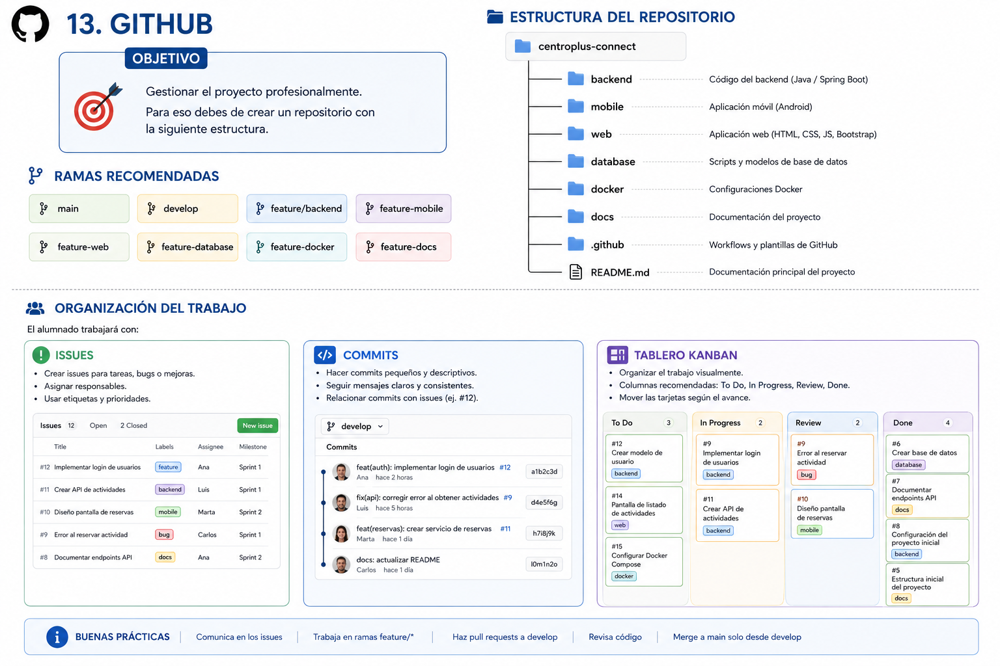

<div align="justify">

## Gestión profesional del proyecto con GitHub

## 1. Objetivo

El objetivo de esta parte del proyecto es aprender a gestionar un proyecto software de forma profesional utilizando:

- Git
- GitHub
- ramas
- issues
- Kanban
- commits organizados

Durante el desarrollo del proyecto intermodular CentroPlus Connect, cada grupo deberá mantener una organización real de trabajo.


<div align="center" width="400">
     
</div>

---

## 2. ¿Qué vamos a aprender?

Con esta práctica aprenderás a:

- crear repositorios GitHub;
- trabajar con ramas;
- organizar tareas;
- usar issues;
- utilizar Kanban;
- colaborar en equipo;
- realizar commits correctamente;
- mantener un flujo profesional de trabajo.

---

## 3. Crear el repositorio

#### Paso 1 — Entrar en GitHub

Accede a:

```text
https://github.com
```

---

#### Paso 2 — Crear un nuevo repositorio

Pulsa:

```text
New repository
```

---

#### Paso 3 — Configuración recomendada

###### Nombre

```text
centroplus-connect
```

---

###### Tipo

```text
Public
```

o

```text
Private
```

---

###### Añadir README

Activar:

```text
Add a README file
```

---

## 4. Clonar el repositorio

#### Obtener la URL

Pulsa:

```text
Code
```

y copia la URL HTTPS.

---

#### Clonar

```bash
git clone https://github.com/usuario/centroplus-connect.git
```

---

## 5. Abrir el proyecto

Entrar en la carpeta:

```bash
cd centroplus-connect
```

---

## 6. Crear las ramas del proyecto

#### Objetivo

Separar el trabajo por funcionalidades.

---

## 7. Ramas obligatorias

#### Rama principal

```text
main
```

Contendrá únicamente versiones estables.

---

#### Rama de integración

```text
develop
```

Contendrá el desarrollo conjunto.

---

#### Ramas de funcionalidades

```text
feature/backend
feature-mobile
feature-web
feature-database
feature-docker
feature-docs
```

---

## 8. Crear ramas

#### Crear develop

```bash
git checkout -b develop
```

---

#### Subir develop

```bash
git push -u origin develop
```

---

#### Crear ramas feature

Ejemplo:

```bash
git checkout -b feature/backend
```

---

#### Subir rama

```bash
git push -u origin feature/backend
```

---

## 9. Organización del trabajo

Cada equipo trabajará utilizando:

- issues;
- tablero Kanban;
- ramas independientes;
- commits organizados.

---

## 10. Uso de Issues

#### Objetivo

Dividir el proyecto en tareas.

---

## 11. Crear un issue

En GitHub:

```text
Issues → New Issue
```

---

## 12. Ejemplos de issues

#### Backend

```text
Crear ActividadService
```

---

#### Base de datos

```text
Diseñar tabla actividades
```

---

#### JavaFX

```text
Crear pantalla de actividades
```

---

#### Web

```text
Implementar listado HTML
```

---

#### Docker

```text
Crear docker-compose
```

---

## 13. Uso del tablero Kanban

#### Objetivo

Organizar visualmente el trabajo.

---

## 14. Crear Kanban

En GitHub:

```text
Projects → New Project
```

Seleccionar:

```text
Board
```

---

## 15. Columnas recomendadas

```text
Pendiente
En progreso
En revisión
Finalizado
```

---

## 16. Flujo de trabajo recomendado

#### Paso 1

Crear issue.

---

#### Paso 2

Asignar issue.

---

#### Paso 3

Mover a:

```text
En progreso
```

---

#### Paso 4

Crear rama feature.

---

#### Paso 5

Programar solución.

---

#### Paso 6

Realizar commits.

---

#### Paso 7

Subir cambios.

---

#### Paso 8

Crear Pull Request.

---

#### Paso 9

Revisar código.

---

#### Paso 10

Fusionar en develop.

---

## 17. Commits profesionales

#### Objetivo

Mantener historial claro.

---

## 18. Formato recomendado

#### Backend

```text
feat: añade ActividadService
```

---

#### Correcciones

```text
fix: corrige cálculo de plazas
```

---

#### Tests

```text
test: añade tests de inscripción
```

---

#### Documentación

```text
docs: actualiza README
```

---

## 19. Subir cambios

#### Añadir archivos

```bash
git add .
```

---

#### Crear commit

```bash
git commit -m "feat: añade pantalla JavaFX"
```

---

#### Subir cambios

```bash
git push
```

---

## 20. Pull Requests

#### Objetivo

Revisar cambios antes de integrar.

---

## 21. Crear Pull Request

En GitHub:

```text
Pull Requests → New Pull Request
```

---

#### Comparar

```text
feature/backend → develop
```

---

## 22. Revisiones

El equipo debe revisar:

- funcionamiento;
- calidad;
- documentación;
- testing;
- estructura.

---

## 23. Merge final

Cuando la funcionalidad esté correcta:

```text
Merge Pull Request
```

---

## 24. Integración final

Cuando todo el proyecto esté terminado:

```text
develop → main
```

---

## 25. Estructura final esperada

```text
centroplus-connect/
│
├── backend-api/
├── mobile-app/
├── web-html/
├── database/
├── docs/
├── docker/
├── README.md
└── docker-compose.yml
```

---

## 26. Buenas prácticas

#### Recomendaciones

- usar ramas pequeñas;
- hacer commits frecuentes;
- documentar cambios;
- evitar subir código roto;
- revisar código entre compañeros;
- mantener Kanban actualizado.

---

## 27. Qué se evaluará

#### Organización GitHub

- ramas;
- issues;
- Kanban;
- commits.

---

#### Calidad técnica

- estructura;
- documentación;
- organización.

---

#### Trabajo en equipo

- colaboración;
- reparto de tareas;
- seguimiento.

---

## 28. Resultado esperado

Al finalizar, el alumnado tendrá experiencia real en:

- gestión de proyectos;
- colaboración;
- flujo Git profesional;
- control de versiones;
- organización software.

---

## 29. Conclusión

GitHub será la herramienta principal de coordinación del proyecto intermodular.

Todo el desarrollo deberá estar:

- organizado;
- documentado;
- versionado;
- dividido en tareas;
- gestionado profesionalmente.

</div>