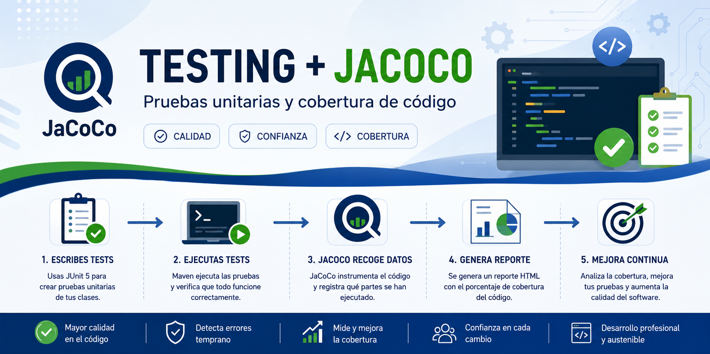
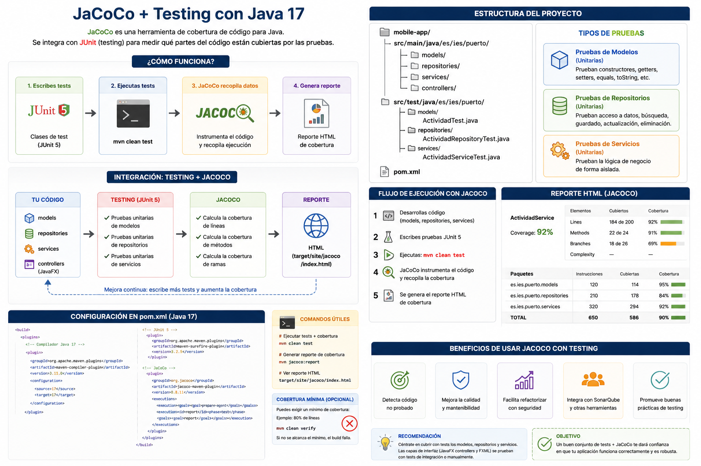

<div align="justify">

# JaCoCo con Java 17 y Maven

<div align="center" width="200">
     
</div>

## Introducción

JaCoCo es una herramienta de cobertura de código para proyectos Java.

Permite medir:

- líneas ejecutadas
- métodos cubiertos
- ramas cubiertas
- porcentaje de cobertura

Se utiliza junto con:

- JUnit 5
- Maven
- Java 17

---

## Objetivos

Implementar:

```text
✔ ejecución automática de cobertura
✔ generación de reportes HTML
✔ integración con Maven
✔ validación de cobertura mínima
```

---

## Tecnologías utilizadas

### Java 17

Versión recomendada para el proyecto.

---

### Maven

Gestión de dependencias y ejecución de tests.

---

### JUnit 5

Framework principal de testing.

---

### JaCoCo

Herramienta de cobertura de código.

---

## Dependencia JUnit 5

Añadir dentro de:

```xml
<dependencies>
```

```xml
<dependency>
    <groupId>org.junit.jupiter</groupId>
    <artifactId>junit-jupiter</artifactId>
    <version>5.10.2</version>
    <scope>test</scope>
</dependency>
```

> Añade una propiedad `<junit.version>5.10.2</junit.version>` y la utilizas `${junit.version}`

---

## Configuración Java 17

Añadir dentro de:

```xml
<build>
    <plugins>
```

```xml
<plugin>
    <groupId>org.apache.maven.plugins</groupId>
    <artifactId>maven-compiler-plugin</artifactId>
    <version>3.11.0</version>

    <configuration>
        <source>17</source>
        <target>17</target>
    </configuration>
</plugin>
```

> Crea una propiedad para la version `3.11.0`

---

## Configuración Maven Surefire

Necesario para ejecutar JUnit 5.

```xml
<plugin>
    <groupId>org.apache.maven.plugins</groupId>
    <artifactId>maven-surefire-plugin</artifactId>
    <version>3.2.5</version>
</plugin>
```

> Crea una propiedad para la version `3.2.5`

---

## Configuración JaCoCo

Añadir dentro de:

```xml
<plugins>
```

```xml
<plugin>
    <groupId>org.jacoco</groupId>
    <artifactId>jacoco-maven-plugin</artifactId>
    <version>0.8.12</version>

    <executions>

        <!-- Activa JaCoCo -->
        <execution>
            <goals>
                <goal>prepare-agent</goal>
            </goals>
        </execution>

        <!-- Genera el reporte -->
        <execution>
            <id>report</id>
            <phase>test</phase>

            <goals>
                <goal>report</goal>
            </goals>
        </execution>

    </executions>

</plugin>
```

> Crea una propiedad para la version `0.8.12`

---

## Configuración completa recomendada

```xml
<build>

    <plugins>

        <plugin>
            <groupId>org.apache.maven.plugins</groupId>
            <artifactId>maven-compiler-plugin</artifactId>
            <version>3.11.0</version>

            <configuration>
                <source>17</source>
                <target>17</target>
            </configuration>
        </plugin>

        <plugin>
            <groupId>org.apache.maven.plugins</groupId>
            <artifactId>maven-surefire-plugin</artifactId>
            <version>3.2.5</version>
        </plugin>

        <!-- JaCoCo -->
        <plugin>
            <groupId>org.jacoco</groupId>
            <artifactId>jacoco-maven-plugin</artifactId>
            <version>0.8.12</version>

            <executions>

                <execution>
                    <goals>
                        <goal>prepare-agent</goal>
                    </goals>
                </execution>

                <execution>
                    <id>report</id>
                    <phase>test</phase>

                    <goals>
                        <goal>report</goal>
                    </goals>
                </execution>

            </executions>

        </plugin>

    </plugins>

</build>
```

> Recuerda escapar las propiedades.

---

## Ejecutar tests y cobertura

## Maven

```bash
mvn clean test
```

---

## Generación del reporte

Después de ejecutar:

```bash
mvn clean test
```

JaCoCo generará automáticamente:

```text
target/site/jacoco/index.html
```

---

## Abrir el reporte

Abrir en navegador:

```text
target/site/jacoco/index.html
```

---

## Qué información proporciona

JaCoCo mostrará:

```text
✔ clases cubiertas
✔ métodos cubiertos
✔ líneas cubiertas
✔ ramas cubiertas
✔ porcentaje total
```

---

## Ejemplo de cobertura

```text
ActividadService.java
Coverage: 92%

✔ findById()
✔ save()
✔ delete()

✘ update()
```

---

## Cobertura mínima obligatoria

Se puede configurar una cobertura mínima.

---

# Ejemplo 80%

```xml
<execution>
    <id>check</id>
    <goals>
        <goal>check</goal>
    </goals>
    <configuration>
        <rules>
            <rule>
                <element>BUNDLE</element>
                <limits>
                    <limit>
                        <counter>LINE</counter>
                        <value>COVEREDRATIO</value>
                        <minimum>0.80</minimum>
                    </limit>
                </limits>
            </rule>
        </rules>
    </configuration>
</execution>
```

---

## Resultado

Si la cobertura es menor del 80%:

```text
BUILD FAILURE
```

---

## Estructura recomendada

```text
src
├── main
│   └── java
│
└── test
    └── java
        └── es
            └── ies
                └── puerto
                    ├── models
                    ├── repositories
                    └── services
```

---

## Cobertura recomendada

### Models

```text
80%
```

---

### Repositories

```text
90%
```

---

### Services

```text
100% lógica crítica
```

---

## Qué debe probarse

### Modelos

```text
✔ constructores
✔ getters
✔ setters
✔ equals
✔ toString
```

---

### Repositorios

```text
✔ findById
✔ save
✔ update
✔ delete
```

---

### Servicios

```text
✔ lógica de negocio
✔ validaciones
✔ errores
✔ reglas funcionales
```

---

# #Recomendaciones

### No probar inicialmente

```text
✘ JavaFX Controllers
✘ FXML
✘ componentes visuales
```

porque normalmente requieren:

- testing funcional
- testing integración
- TestFX

---

## Herramientas recomendadas

### Fase inicial

```text
JUnit 5
+
JaCoCo
```

---

### Fase avanzada

```text
Mockito
+
TestFX
+
SonarQube
```

---

## Beneficios de JaCoCo

```text
✔ detecta código sin probar
✔ mejora calidad
✔ evita regresiones
✔ ayuda a refactorizar
✔ facilita mantenimiento
✔ aporta métricas reales
```

<div align="center" width="400">
     
</div>

---

## Conclusión

JaCoCo es una herramienta fundamental para garantizar calidad en proyectos Java.

Permite:

- medir cobertura
- detectar código no probado
- mejorar robustez
- validar calidad del proyecto
- integrar testing continuo

</div>