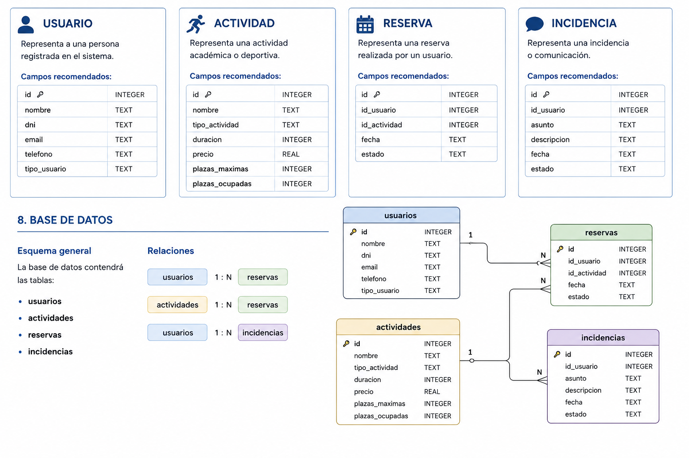

<div align="justify">

# Creación de la base de datos SQLite3

## 1. Objetivo

En esta parte del proyecto vamos a crear la base de datos del sistema **CentroPlus Connect** usando **SQLite3**.

La base de datos almacenará la información principal de la aplicación:

```text
usuarios
actividades
reservas
incidencias
```

Esta base de datos será utilizada posteriormente por:

- la API REST;
- la aplicación JavaFX;
- la página HTML;
- los tests del proyecto.

---

## 2. Esquema general

La base de datos contendrá las siguientes tablas:

```text
usuarios
actividades
reservas
incidencias
```

---

## 3. Relaciones entre tablas

Las relaciones serán:

```text
usuarios 1:N reservas
actividades 1:N reservas
usuarios 1:N incidencias
```

Esto significa:

- un usuario puede tener muchas reservas;
- una actividad puede estar asociada a muchas reservas;
- un usuario puede registrar muchas incidencias.

---

## 4. Diagrama de base de datos

El proyecto puede incluir una imagen del diagrama en:

```text
../images/diagrama-bd.png
```

Y se puede mostrar en el README así:

```html
<div align="center" width="400">
     
</div>
```

---

## 5. Estructura recomendada de carpetas

Crea esta estructura dentro del proyecto:

```text
centroplus-connect/
│
├── database/
│   ├── centroplus.db
│   ├── schema.sql
│   └── seed.sql
│
├── images/
│   └── diagrama-bd.png
│
└── README.md
```

---

## 6. Crear la carpeta database

Desde la raíz del proyecto:

```bash
mkdir database
```

Entrar en la carpeta:

```bash
cd database
```

---

## 7. Crear la base de datos SQLite3

Ejecuta:

```bash
sqlite3 centroplus.db
```

Esto abrirá la consola de SQLite.

Verás algo parecido a:

```text
SQLite version ...
Enter ".help" for usage hints.
sqlite>
```

---

## 8. Activar claves foráneas

SQLite no siempre activa las claves foráneas por defecto.

Dentro de SQLite ejecuta:

```sql
PRAGMA foreign_keys = ON;
```

Para comprobarlo:

```sql
PRAGMA foreign_keys;
```

Debe devolver:

```text
1
```

---

## 9. Crear el fichero schema.sql

Crea un fichero llamado:

```text
schema.sql
```

Este fichero contendrá la estructura de las tablas.

---

## 10. Tabla usuarios

La tabla `usuarios` almacena las personas registradas en el sistema.

#### Campos

| Campo | Tipo | Descripción |
|---|---|---|
| id | INTEGER | Identificador |
| nombre | TEXT | Nombre completo |
| dni | TEXT | DNI/NIE |
| email | TEXT | Correo electrónico |
| telefono | TEXT | Teléfono |
| tipo_usuario | TEXT | ALUMNO, SOCIO o AMBOS |

#### SQL

```sql
CREATE TABLE usuarios (
    id INTEGER PRIMARY KEY,
    nombre TEXT NOT NULL,
    dni TEXT NOT NULL UNIQUE,
    email TEXT NOT NULL,
    telefono TEXT,
    tipo_usuario TEXT NOT NULL
);
```

---

## 11. Tabla actividades

La tabla `actividades` almacena actividades académicas o deportivas.

#### Campos

| Campo | Tipo | Descripción |
|---|---|---|
| id | INTEGER | Identificador |
| nombre | TEXT | Nombre |
| tipo_actividad | TEXT | ACADEMICA o DEPORTIVA |
| duracion | INTEGER | Duración en minutos |
| precio | REAL | Precio |
| plazas_maximas | INTEGER | Número máximo de plazas |
| plazas_ocupadas | INTEGER | Número de plazas ocupadas |

#### SQL

```sql
CREATE TABLE actividades (
    id INTEGER PRIMARY KEY,
    nombre TEXT NOT NULL,
    tipo_actividad TEXT NOT NULL,
    duracion INTEGER NOT NULL,
    precio REAL NOT NULL,
    plazas_maximas INTEGER NOT NULL,
    plazas_ocupadas INTEGER NOT NULL
);
```

---

## 12. Tabla reservas

La tabla `reservas` almacena las reservas realizadas por los usuarios.

#### Campos

| Campo | Tipo | Descripción |
|---|---|---|
| id | INTEGER | Identificador |
| id_usuario | INTEGER | Usuario que reserva |
| id_actividad | INTEGER | Actividad reservada |
| fecha | TEXT | Fecha de reserva |
| estado | TEXT | ACTIVA o CANCELADA |

#### Relaciones

```text
reservas.id_usuario → usuarios.id
reservas.id_actividad → actividades.id
```

#### SQL

```sql
CREATE TABLE reservas (
    id INTEGER PRIMARY KEY,
    id_usuario INTEGER NOT NULL,
    id_actividad INTEGER NOT NULL,
    fecha TEXT NOT NULL,
    estado TEXT NOT NULL,
    FOREIGN KEY (id_usuario) REFERENCES usuarios(id),
    FOREIGN KEY (id_actividad) REFERENCES actividades(id)
);
```

---

## 13. Tabla incidencias

La tabla `incidencias` almacena comunicaciones o problemas enviados por usuarios.

#### Campos

| Campo | Tipo | Descripción |
|---|---|---|
| id | INTEGER | Identificador |
| id_usuario | INTEGER | Usuario que crea la incidencia |
| asunto | TEXT | Asunto |
| descripcion | TEXT | Descripción |
| fecha | TEXT | Fecha |
| estado | TEXT | ABIERTA, EN_PROCESO o CERRADA |

#### Relación

```text
incidencias.id_usuario → usuarios.id
```

#### SQL

```sql
CREATE TABLE incidencias (
    id INTEGER PRIMARY KEY,
    id_usuario INTEGER NOT NULL,
    asunto TEXT NOT NULL,
    descripcion TEXT NOT NULL,
    fecha TEXT NOT NULL,
    estado TEXT NOT NULL,
    FOREIGN KEY (id_usuario) REFERENCES usuarios(id)
);
```

---

## 14. Contenido completo de schema.sql

El fichero completo puede quedar así:

```sql
PRAGMA foreign_keys = ON;

DROP TABLE IF EXISTS incidencias;
DROP TABLE IF EXISTS reservas;
DROP TABLE IF EXISTS actividades;
DROP TABLE IF EXISTS usuarios;

CREATE TABLE usuarios (
    id INTEGER PRIMARY KEY,
    nombre TEXT NOT NULL,
    dni TEXT NOT NULL UNIQUE,
    email TEXT NOT NULL,
    telefono TEXT,
    tipo_usuario TEXT NOT NULL
);

CREATE TABLE actividades (
    id INTEGER PRIMARY KEY,
    nombre TEXT NOT NULL,
    tipo_actividad TEXT NOT NULL,
    duracion INTEGER NOT NULL,
    precio REAL NOT NULL,
    plazas_maximas INTEGER NOT NULL,
    plazas_ocupadas INTEGER NOT NULL
);

CREATE TABLE reservas (
    id INTEGER PRIMARY KEY,
    id_usuario INTEGER NOT NULL,
    id_actividad INTEGER NOT NULL,
    fecha TEXT NOT NULL,
    estado TEXT NOT NULL,
    FOREIGN KEY (id_usuario) REFERENCES usuarios(id),
    FOREIGN KEY (id_actividad) REFERENCES actividades(id)
);

CREATE TABLE incidencias (
    id INTEGER PRIMARY KEY,
    id_usuario INTEGER NOT NULL,
    asunto TEXT NOT NULL,
    descripcion TEXT NOT NULL,
    fecha TEXT NOT NULL,
    estado TEXT NOT NULL,
    FOREIGN KEY (id_usuario) REFERENCES usuarios(id)
);
```

---

## 15. Ejecutar schema.sql

Desde la carpeta `database`:

```bash
sqlite3 centroplus.db < schema.sql
```

Esto crea las tablas dentro de la base de datos.

---

## 16. Comprobar tablas creadas

Entrar en SQLite:

```bash
sqlite3 centroplus.db
```

Ejecutar:

```sql
.tables
```

Debe aparecer:

```text
actividades  incidencias  reservas  usuarios
```

---

## 17. Ver estructura de una tabla

Ejemplo:

```sql
.schema usuarios
```

También puedes consultar todas:

```sql
.schema
```

---

## 18. Crear el fichero seed.sql

El fichero `seed.sql` contendrá datos iniciales para probar la aplicación.

---

## 19. Insertar usuarios

```sql
INSERT INTO usuarios (id, nombre, dni, email, telefono, tipo_usuario)
VALUES
(1, 'Ana Pérez', '11111111A', 'ana@email.com', '600111111', 'ALUMNO'),
(2, 'Luis Ramos', '22222222B', 'luis@email.com', '600222222', 'SOCIO'),
(3, 'Marta Díaz', '33333333C', 'marta@email.com', '600333333', 'AMBOS');
```

---

## 20. Insertar actividades

```sql
INSERT INTO actividades (
    id, nombre, tipo_actividad, duracion, precio, plazas_maximas, plazas_ocupadas
)
VALUES
(1, 'Yoga', 'DEPORTIVA', 60, 25.50, 15, 8),
(2, 'Programación Java', 'ACADEMICA', 90, 40.00, 20, 12),
(3, 'Spinning', 'DEPORTIVA', 45, 18.00, 12, 12),
(4, 'Inglés técnico', 'ACADEMICA', 60, 30.00, 18, 6),
(5, 'Sistemas Linux', 'ACADEMICA', 120, 45.00, 16, 10);
```

---

## 21. Insertar reservas

```sql
INSERT INTO reservas (id, id_usuario, id_actividad, fecha, estado)
VALUES
(1, 1, 1, '2025-01-10', 'ACTIVA'),
(2, 2, 2, '2025-01-11', 'ACTIVA');
```

---

## 22. Insertar incidencias

```sql
INSERT INTO incidencias (id, id_usuario, asunto, descripcion, fecha, estado)
VALUES
(1, 1, 'Problema con reserva', 'No puedo reservar una plaza', '2025-01-12', 'ABIERTA'),
(2, 2, 'Cambio de horario', 'El horario de la actividad no coincide', '2025-01-13', 'EN_PROCESO');
```

---

## 23. Contenido completo de seed.sql

```sql
PRAGMA foreign_keys = ON;

INSERT INTO usuarios (id, nombre, dni, email, telefono, tipo_usuario)
VALUES
(1, 'Ana Pérez', '11111111A', 'ana@email.com', '600111111', 'ALUMNO'),
(2, 'Luis Ramos', '22222222B', 'luis@email.com', '600222222', 'SOCIO'),
(3, 'Marta Díaz', '33333333C', 'marta@email.com', '600333333', 'AMBOS');

INSERT INTO actividades (
    id, nombre, tipo_actividad, duracion, precio, plazas_maximas, plazas_ocupadas
)
VALUES
(1, 'Yoga', 'DEPORTIVA', 60, 25.50, 15, 8),
(2, 'Programación Java', 'ACADEMICA', 90, 40.00, 20, 12),
(3, 'Spinning', 'DEPORTIVA', 45, 18.00, 12, 12),
(4, 'Inglés técnico', 'ACADEMICA', 60, 30.00, 18, 6),
(5, 'Sistemas Linux', 'ACADEMICA', 120, 45.00, 16, 10);

INSERT INTO reservas (id, id_usuario, id_actividad, fecha, estado)
VALUES
(1, 1, 1, '2025-01-10', 'ACTIVA'),
(2, 2, 2, '2025-01-11', 'ACTIVA');

INSERT INTO incidencias (id, id_usuario, asunto, descripcion, fecha, estado)
VALUES
(1, 1, 'Problema con reserva', 'No puedo reservar una plaza', '2025-01-12', 'ABIERTA'),
(2, 2, 'Cambio de horario', 'El horario de la actividad no coincide', '2025-01-13', 'EN_PROCESO');
```

---

## 24. Ejecutar seed.sql

```bash
sqlite3 centroplus.db < seed.sql
```

---

## 25. Comprobar datos

Entrar en SQLite:

```bash
sqlite3 centroplus.db
```

Consultar usuarios:

```sql
SELECT * FROM usuarios;
```

Consultar actividades:

```sql
SELECT * FROM actividades;
```

Consultar reservas:

```sql
SELECT * FROM reservas;
```

Consultar incidencias:

```sql
SELECT * FROM incidencias;
```

---

## 26. Consultas útiles para probar

#### Actividades con plazas disponibles

```sql
SELECT nombre, plazas_maximas - plazas_ocupadas AS plazas_disponibles
FROM actividades;
```

---

#### Reservas con nombre de usuario y actividad

```sql
SELECT r.id, u.nombre AS usuario, a.nombre AS actividad, r.fecha, r.estado
FROM reservas r
JOIN usuarios u ON r.id_usuario = u.id
JOIN actividades a ON r.id_actividad = a.id;
```

---

#### Incidencias por usuario

```sql
SELECT i.id, u.nombre, i.asunto, i.estado
FROM incidencias i
JOIN usuarios u ON i.id_usuario = u.id;
```

---

#### Actividades completas

```sql
SELECT *
FROM actividades
WHERE plazas_ocupadas >= plazas_maximas;
```

---

## 27. Crear una copia de seguridad

Una vez creada y cargada la base de datos:

```bash
cp centroplus.db centroplus-backup.db
```

La estructura quedaría:

```text
database/
├── centroplus.db
├── centroplus-backup.db
├── schema.sql
└── seed.sql
```

---

## 28. Restaurar la base de datos desde backup

Si necesitas restaurar:

```bash
cp centroplus-backup.db centroplus.db
```

---

## 29. Uso desde Java

La ruta JDBC será:

```text
jdbc:sqlite:database/centroplus.db
```

Ejemplo de configuración:

```java
String url = "jdbc:sqlite:database/centroplus.db";
```

---

## 30. Validaciones recomendadas

Aunque SQLite permita guardar texto libre, la aplicación debe validar:

#### tipo_usuario

Valores válidos:

```text
ALUMNO
SOCIO
AMBOS
```

#### tipo_actividad

Valores válidos:

```text
ACADEMICA
DEPORTIVA
```

#### estado de reserva

Valores válidos:

```text
ACTIVA
CANCELADA
```

#### estado de incidencia

Valores válidos:

```text
ABIERTA
EN_PROCESO
CERRADA
```

---

## 31. Resultado final

Al terminar esta parte deberás tener:

```text
database/
├── centroplus.db
├── centroplus-backup.db
├── schema.sql
└── seed.sql
```

Y la base de datos deberá contener:

```text
usuarios
actividades
reservas
incidencias
```

Con las relaciones:

```text
usuarios 1:N reservas
actividades 1:N reservas
usuarios 1:N incidencias
```

---

## 32. Comandos resumen

```bash
mkdir database
cd database

sqlite3 centroplus.db < schema.sql
sqlite3 centroplus.db < seed.sql

sqlite3 centroplus.db
.tables
.schema
SELECT * FROM usuarios;
.exit

cp centroplus.db centroplus-backup.db
```

---

## 33. Entrega esperada

El alumnado debe entregar:

- `centroplus.db`
- `centroplus-backup.db`
- `schema.sql`
- `seed.sql`
- captura del diagrama
- README documentando la base de datos
