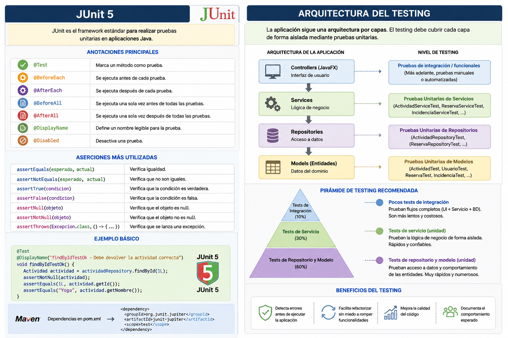

<div align="justify">

# README-TESTING.md

# Testing en la aplicación móvil JavaFX

## Introducción

El testing permite validar el comportamiento de la aplicación antes de desplegarla o entregarla.

El objetivo principal es garantizar que:

- los modelos funcionan correctamente
- los repositorios gestionan bien los datos
- los servicios implementan correctamente la lógica de negocio
- las funcionalidades críticas no se rompen con cambios futuros

<div align="center" width="400">
     
</div>

---

# Objetivos del testing

Implementar pruebas para:

```text
✔ Modelos
✔ Repositorios
✔ Servicios
```

---

# Tecnologías recomendadas

## JUnit 5

Framework principal para testing.

## Maven

Las pruebas se ejecutarán mediante:

```bash
mvn clean test
```

---

# Estructura recomendada

```text
src
├── main
│   └── java
│
└── test
    └── java
        └── es
            └── ies
                └── puerto
                    ├── models
                    ├── repositories
                    └── services
```

---

# Convención de nombres

Todos los tests deben seguir el patrón:

```text
nombreFuncion + Test + Caso
```

Ejemplos:

```text
findByIdTestOk
findByIdTestNull
findByIdTestNotFound
saveTestOk
deleteTestOk
```

---

# Testing de modelos

## Objetivo

Validar:

- constructores
- getters
- setters
- equals
- hashCode
- toString
- validaciones simples

---

# Ejemplo: ActividadTest

```java
public class ActividadTest {
}
```

---

# Ejemplos de nombres válidos

## Constructor

```text
constructorTestOk
constructorTestNull
```

---

## Getters

```text
getIdTestOk
getNombreTestOk
getDescripcionTestOk
```

---

## Setters

```text
setNombreTestOk
setDescripcionTestOk
```

---

## Equals

```text
equalsTestOk
equalsTestFalse
```

---

## ToString

```text
toStringTestOk
```

---

# Ejemplo completo

```java
@Test
public void getNombreTestOk() {

    Actividad actividad = new Actividad();
    actividad.setNombre("Yoga");

    Assertions.assertEquals(
            "Yoga",
            actividad.getNombre()
    );
}
```

---

# Testing de repositorios

## Objetivo

Validar operaciones CRUD.

---

# Métodos típicos

```text
findAll
findById
save
update
delete
```

---

# Ejemplos de tests

## findById

```text
findByIdTestOk
findByIdTestNull
findByIdTestNotFound
```

---

## save

```text
saveTestOk
saveTestNull
saveTestDuplicated
```

---

## update

```text
updateTestOk
updateTestNotFound
```

---

## delete

```text
deleteTestOk
deleteTestNotFound
```

---

# Ejemplo

```java
@Test
public void findByIdTestOk() {

    Actividad actividad = repository.findById(1);

    Assertions.assertNotNull(actividad);
}
```

---

# Testing de servicios

## Objetivo

Validar la lógica de negocio.

Los servicios son la parte más importante de la aplicación.

---

# Qué debe probarse

## Reservas

```text
✔ reservar plaza
✔ cancelar reserva
✔ evitar duplicados
✔ controlar plazas máximas
```

---

## Actividades

```text
✔ crear actividad
✔ buscar actividad
✔ validar datos
```

---

## Incidencias

```text
✔ crear incidencia
✔ validar asunto
✔ validar descripción
```

---

# Ejemplos de nombres

## ReservaServiceTest

```text
reservarPlazaTestOk
reservarPlazaTestActividadCompleta
reservarPlazaTestUsuarioDuplicado
cancelarReservaTestOk
```

---

## ActividadServiceTest

```text
findByIdTestOk
findByIdTestNotFound
saveTestOk
saveTestNull
```

---

## IncidenciaServiceTest

```text
crearIncidenciaTestOk
crearIncidenciaTestAsuntoVacio
crearIncidenciaTestDescripcionVacia
```

---

# Recomendaciones

## Cada test debe validar una única cosa

Correcto:

```text
findByIdTestOk
```

Incorrecto:

```text
findByIdAndDeleteAndSaveTest
```

---

# Los tests deben ser independientes

Nunca depender de:

- orden de ejecución
- datos modificados por otros tests

---

# Utilizar nombres claros

Correcto:

```text
findByIdTestNotFound
```

Incorrecto:

```text
test1
```

---

# Cobertura mínima recomendada

## Modelos

```text
80%
```

---

## Repositorios

```text
90%
```

---

## Servicios

```text
100% lógica crítica
```

---

# Ejemplo de estructura final

```text
src/test/java/es/ies/puerto/

├── models
│   ├── ActividadTest.java
│   ├── ReservaTest.java
│   ├── UsuarioTest.java
│   └── IncidenciaTest.java
│
├── repositories
│   ├── ActividadRepositoryTest.java
│   ├── ReservaRepositoryTest.java
│   └── IncidenciaRepositoryTest.java
│
└── services
    ├── ActividadServiceTest.java
    ├── ReservaServiceTest.java
    └── IncidenciaServiceTest.java
```

---

# Ejecución de tests

## Maven

```bash
mvn clean test
```

---


</div>