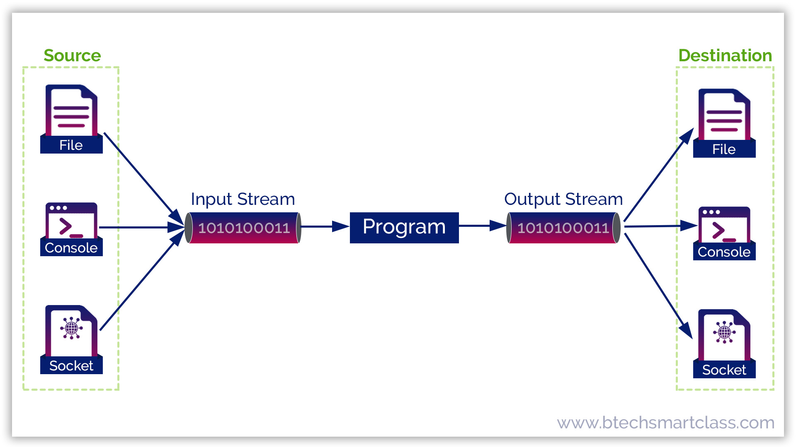
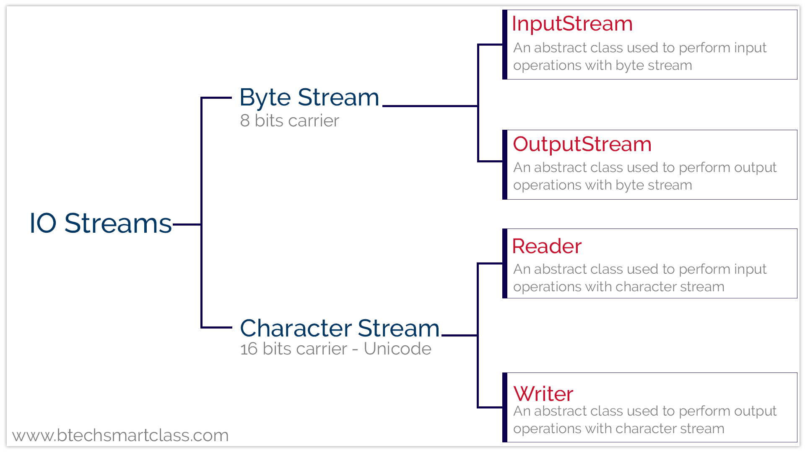

#  Code & Learn (Programación: Sistema de Ficheros)

## Flujo de información en java

En Java, las operaciones de E/S se realizan utilizando el concepto de flujos. En general, un flujo significa un flujo continuo de datos. En Java, un flujo es un contenedor lógico de datos que nos permite leer y escribir en él. Un flujo se puede vincular a una fuente de datos o a un destino de datos, como una consola, un archivo o una conexión de red mediante el sistema de E/S de Java. Las operaciones de E/S basadas en flujos son más rápidas que las operaciones de E/S normales.

El flujo se define en el paquete **java.io.**.

Para comprender la funcionalidad de los flujos de Java, observe la siguiente imagen.

# Operaciones de E/S en Java

En Java, las operaciones de E/S basadas en secuencias se realizan utilizando dos secuencias independientes: la secuencia de entrada y la secuencia de salida. La secuencia de entrada se utiliza para las operaciones de entrada y la secuencia de salida se utiliza para las operaciones de salida. La secuencia de Java está compuesta de **bytes**.

## Secuencias Automáticas en Java

Cada programa en Java crea automáticamente tres secuencias, que se adjuntan a la consola:

- `System.out`: Flujo de salida estándar para operaciones de salida de consola.
- `System.in`: Flujo de entrada estándar para operaciones de entrada de consola.
- `System.err`: Flujo de error estándar para operaciones de salida de errores de consola.

Los flujos de Java admiten muchos tipos diferentes de datos, incluidos **bytes simples**, **tipos de datos primitivos**, **caracteres localizados** y **objetos**.

## Tipos de Flujos en Java

Java proporciona dos tipos principales de transmisiones:

1. **Flujo de bytes**
2. **Flujo de caracteres**

La siguiente imagen muestra cómo se clasifican los flujos y las varias clases integradas que utiliza el sistema de E/S (entrada/salida) de Java.

## Flujos de E/S en Java

Tanto los flujos de **caracteres** como los de **bytes** proporcionan una forma conveniente y eficiente de manejar flujos de datos en Java.

## Índice

- [Csv/Xml/Json](CSV-XML-JSON.md)
- [Manejo de ficheros en Java (Csv)](MANEJO-FICHEROS-JAVA.md)
- [Manejo de ficheros en Java (Xml)](FICHEROS-XML.md)
- [Manejo de ficheros en Java (Json)](FICHEROS-JSON.md)

## Licencia 📄

Este proyecto está bajo la Licencia (Apache 2.0) - mira el archivo [LICENSE.md](../LICENSE.md) para detalles.

