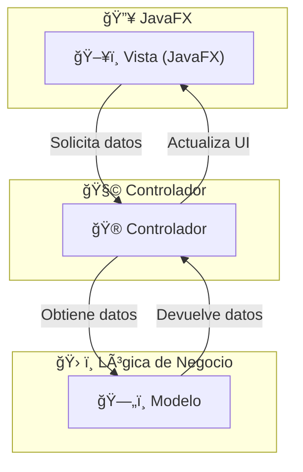

<div align="justify">

#  Code & Learn (Programación: Trabajando con Interfaces-Maven)

Este documento te proporciona una guía paso a paso para crear un proyecto Maven que utilice JavaFX para la interfaz de usuario, pruebas unitarias y el patrón de diseño Modelo-Vista-Controlador (MVC).

## Requisitos Previos

Asegúrate de tener los siguientes requisitos instalados en tu sistema:

- **Java Development Kit (JDK)**: Versión 11 o superior (preferentemente JDK 17+).
- **Apache Maven**: Para gestionar dependencias y construir el proyecto.
- **IDE**: Puedes usar IntelliJ IDEA, Eclipse o cualquier otro IDE compatible con Maven y JavaFX.

---

## 1. Crear el Proyecto Maven

### Estructura básica del proyecto

Primero, crea un proyecto Maven básico con la siguiente estructura:

```code
mi-proyecto-javafx/
│── src/
│   ├── main/
│   │   ├── java/
│   │   │   ├── es/
│   │   │   │   ├── ies/
│   │   │   │   │   ├── puerto/
│   │   │   │   │   │   ├── MainApp.java            # Clase principal
│   │   │   │   │   │   ├── controladores/
│   │   │   │   │   │   │   ├── PrincipalController.java
│   │   │   │   │   │   ├── modelos/
│   │   │   │   │   │   │   ├── Usuario.java
│   │   │   │   │   │   │   ├── GestorUsuarios.java
│   │   │   │   │   │   ├── vistas/                 # (Opcional: si tienes clases de vista)
│   │   ├── resources/
│   │   │   ├── fxml/
│   │   │   │   ├── principal.fxml                   # Interfaz principal
│   │   │   ├── css/
│   │   │   │   ├── estilos.css                      # Estilos personalizados
│   │   │   ├── images/
│   │   │   │   ├── logo.png
│   ├── test/
│   │   ├── java/
│   │   │   ├── es/
│   │   │   │   ├── ies/
│   │   │   │   │   ├── puerto/
│   │   │   │   │   │   ├── MainAppTest.java         # Pruebas unitarias
│── pom.xml
│── README.md
```

## 2. Configuración del archivo `pom.xml`

### Dependencias necesarias en `pom.xml`

Tu archivo `pom.xml` debe incluir las siguientes dependencias para JavaFX, pruebas unitarias y cualquier otra librería adicional.

```xml
<properties>
        <project.build.sourceEncoding>UTF-8</project.build.sourceEncoding>
        <maven.compiler.source>17</maven.compiler.source>
        <maven.compiler.target>17</maven.compiler.target>
        <javafx.version>21</javafx.version>
        <junit.version>5.9.2</junit.version>
        <javafx-maven-plugin.version>0.0.8</javafx-maven-plugin.version>
        <maven-compiler-plugin.version>3.11.0</maven-compiler-plugin.version>
        <controlsfx.version>11.2.0</controlsfx.version>
    </properties>
    <!-- Dependencias de JavaFX -->
        <dependency>
            <groupId>org.openjfx</groupId>
            <artifactId>javafx-controls</artifactId>
            <version>${javafx.version}</version>
        </dependency>
        <dependency>
            <groupId>org.openjfx</groupId>
            <artifactId>javafx-fxml</artifactId>
            <version>${javafx.version}</version>
        </dependency>

        <!-- Biblioteca ControlsFX para UI mejorada -->
        <dependency>
            <groupId>org.controlsfx</groupId>
            <artifactId>controlsfx</artifactId>
            <version>${controlsfx.version}</version>
        </dependency>
        ...
```

El plugin que es más importante es el siguiente:

```xml
<plugin>
    <groupId>org.openjfx</groupId>
    <artifactId>javafx-maven-plugin</artifactId>
    <version>${javafx-maven-plugin.version}</version>
    <executions>
        <execution>
            <id>default-cli</id>
            <goals>
                <goal>run</goal>
            </goals>
        </execution>
    </executions>
    <configuration>
        <mainClass>es.ies.puerto.PrincipalApplication</mainClass>
    </configuration>
</plugin>
```

Como podemos observar, la clase **es.ies.puerto.PrincipalApplication** es la clase principal **(Contiene el Main)**, y lanza la aplicación.

## Estructura de dependencias de responsabilidad

### Modelo

- Representa los datos y la lógica de negocio.
- Puede incluir clases que gestionan acceso a bases de datos, cálculos, etc.
- No tiene ninguna referencia a **JavaFX**.

```java
public class Usuario {
    private String nombre;
    private int edad;

    public Usuario(String nombre, int edad) {
        this.nombre = nombre;
        this.edad = edad;
    }

    public String getNombre() { return nombre; }
    public void setNombre(String nombre) { this.nombre = nombre; }

    public int getEdad() { return edad; }
    public void setEdad(int edad) { this.edad = edad; }
}
```

### Vista (View)

- Es el archivo FXML o el código en Java que define la interfaz gráfica.
- No contiene lógica de negocio, solo la estructura visual.

```xml
<?xml version="1.0" encoding="UTF-8"?>
<?import javafx.scene.control.*?>
<?import javafx.scene.layout.*?>
<VBox xmlns="http://javafx.com/javafx/8.0.171" xmlns:fx="http://javafx.com/fxml/1"
      fx:controller="controlador.UsuarioController">
    <Label text="Nombre:"/>
    <TextField fx:id="nombreField"/>
    <Label text="Edad:"/>
    <TextField fx:id="edadField"/>
    <Button text="Mostrar" onAction="#mostrarUsuario"/>
</VBox>
```

### Controlador (Controller)

- Se encarga de manejar la interacción del usuario.
- Usa los datos del Modelo y los actualiza en la Vista.
- Se conecta con los elementos del FXML.

```java
package controlador;

import javafx.fxml.FXML;
import javafx.scene.control.TextField;
import modelo.Usuario;

public class UsuarioController {
    @FXML private TextField nombreField;
    @FXML private TextField edadField;

    public void mostrarUsuario() {
        String nombre = nombreField.getText();
        int edad = Integer.parseInt(edadField.getText());

        Usuario usuario = new Usuario(nombre, edad);
        System.out.println("Usuario: " + usuario.getNombre() + ", Edad: " + usuario.getEdad());
    }
}
```

En JavaFX, el **FXML** define la interfaz gráfica, mientras que el **Controlador** gestiona la lógica de la aplicación. La relación entre ambos se establece a través de `fx:controller` y la vinculación de elementos con `@FXML`.

## ⚡ Interacción entre FXML y el Controlador

1. **El FXML define la interfaz** con etiquetas XML.
2. **El Controlador maneja eventos** en respuesta a interacciones del usuario.
3. **`fx:controller` enlaza el FXML con su Controlador**.
4. **Los elementos de la UI se vinculan con `@FXML`** en el controlador para manipularlos desde el código.

---

## Arquitectura y responsabilidades



## Comandos Maven

Para lanzar nuestra app en maven debemos ejecutar el siguiente código:

```code
mvn clean javafx:run
```

</div>